# Earth Observation Science (GEOM2084)
Module 1 Prac - Getting started with Google Earth Engine, image visualisation, and band combination


### Acknowledgments 
- [Earth Engine Beginning Curriculum](https://docs.google.com/document/d/1ZxRKMie8dfTvBmUNOO0TFMkd7ELGWf3WjX0JvESZdOE/edit#!)
- [Google Earth Engine guide](https://developers.google.com/earth-engine/guides)


### Prerequisites
Completion of this Prac exercise requires the use of the Google Chrome browser and a Google Earth Engine account. If you have not yet signed up - please do so now in a new tab: [Earth Engine account registration](https://signup.earthengine.google.com/). I have also prepared a guide document (available in you Canvas shell) to help you signup. Post in the discussion board if you are stuck.

Once registered you can access the Earth Engine environment [here:](https://code.earthengine.google.com)

Google Earth Engine uses the JavaScript programming language. We will cover the very basics of this language during this course. If you would like more detail you can read through the introduction provided here: [JavaScript background](https://developers.google.com/earth-engine/tutorials/tutorial_js_01)

### Objective
The learning objectives of this Prac are:
- to learn navigate within the GEE.
- to be able to look for specific data/image and associated metadata.
- to learn visualisation of single-band images.
- to learn visualisation of multi-band images.<!-- This content will not appear in the rendered Markdown -->
- to apply color composite to dispalay a desired band combination. 

### Table of Contents  
[1. Navigate through the GEE environment interface.](#headers)  


---------------------------------------------------

## 1. Navigate through the GEE environment interface.

1. Open up the Google Earth Engine environment by going to this address in the **Chrome browser**: [https://code.earthengine.google.com](https://code.earthengine.google.com). You should see the GEE landing page as below. This suggests that your signup and activation of the Earth Engine account went through well. 

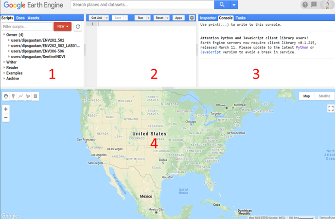

2. Notice GEE environment is divided up into four panels: 
- The top-left panel has tabs for Scripts, Documentation and Assets 
	- Scripts tab for managing your programming scripts.
	- Docs tab for accessing documentation of Earth Engine objects and methods, as well as a few specific to the Code Editor application
	- Assets tab for managing assets that you upload. 
- The editor (top-centre) panel is for writing and running JavaScript commands  
- The top-right panel has tabs for the console, inspector and tasks  
	- Console tab for printing output.
	- Inspector tab for querying map results.
	- Tasks tab for managing long running tasks.
- The bottom panel is a Map interface with geometry features and a google map like feel. 
- Search bar on the top to look for datasets and places of interest

3. I recommend you take the feature tour to learn more.

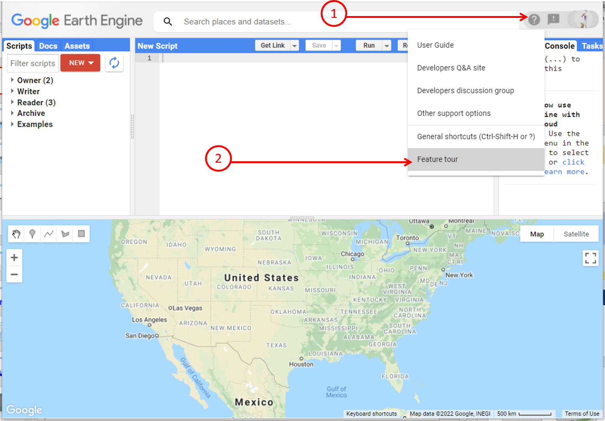   

4. In this unit, you will frequently use following buttons and tabs: "Run", "Save", "Search", "Inspector", "Console", "Tasks", "Scripts", "Docs", and "Assets". Think about and do a google search on what the functionality of the above buttons and tabs are. 

**Question:** *What do you think will the "Run" button do?*

## 2. A basic introduction to JavaScript

1. Okay this is just going to be very basic and we will learn what we need. If you are interested to dive deeper into JavaScript for Earth Engine, I recommend you have a look into  [this](https://developers.google.com/earth-engine/tutorials/tutorial_js_01). You will find various guides and tutorial for Earth Engine that you can explore at your own time. Time to write your first JavaScript for Earth Engine! In the editor panel, paste the below script and hit run. "Hello World!" will be printed on the console tab. 
 
```JavaScript
print("Hello World!");
```

2. The line above is a JavaScript statement. JavaScript statements end in a semicolon. Earth Engine programs are made up of a set of statements like this one. You can think of these statements as a set of tasks you want the Earth Engine to perform. Using the "print" command, you can print any text you want. Note that JavaScript and any other programming are quite restrictive in their syntax. The barebone structure "print(" ")" cannot be changed. Any text that is placed within the quotation gets printed.

**Question:** *Modify the above script to print your name in the console.*

3. When writing a rather long JavaScript program, it is a good practice to put lots of comments in your code- the comments are for ourself and not for Earth Engine to execute. The comments helps us to remember what we were trying to do. To comment, use "//" before the comment. for example: 

```JavaScript
// Printing hello world to the console
print("Hello World!");
```

4. In the above script, the content after "//" is ignored by the Earth Engine. These comments are for us to understand what's happening in the script. 

5. Using variables to store objects helps code readability of our code. For example, we can use a variable to store a string (text) object. Note the string object is placed within a single ' or double " quotes but don't mix them. In the below script, first, we create a new variable called toPrint which stores the text we want to print. Think of variable as a container that stores something. The idea is to later execute a task (e.g. print) for whatever is stored in that container. Now in the script below we print the variable toPrint which is 'Ahoy there!'. So, if you run the script, it will print 'Ahoy there!'

```JavaScript
// Use single (or double) quotes for text.
var toPrint = 'Ahoy there!';
// Use parentheses to pass arguments to the command.
print(toPrint);
```

6. You may have noticed that we used a keyword "var" at the beginning of the script. "var" is always used when defining a variable. The name "toPrint" that we gave to the variable can be anything we want - but be consistent throughout a JavaScript program. You can now a) try changing the name of the variable and run the script, b) try modifying the script to print something else. 

7. Variables can also store numbers. We define the number variables using the same way as string variables -  we just don't need to put the numbers in quotes. 

```JavaScript
// Store a number in a variable.
var height = 165;
print('My height is:', height);
```
8. Notice how within the print command, the text variable was placed in quotation while the numerical variable is not in the quotation. 

9. Now you can try a) modifying the variable name "height" as well as the variable value to print your height b) print your name and age together using two variables. 

10. The best way to learn Scripting is to modify the script and make many mistakes - many many mistakes. If you are new to scripting and JavaScript, try to change and run the script and see what happens.

## 3. Finding images and datasets

1. There are basically two ways of finding images in GEE. One by exploring the data catalogue and second by just searching for the particular image that you want.

2. Let's first look at the data catalogue. To get to the data catalogue, you can go to this [link](https://developers.google.com/earth-engine/datasets/) or in your GEE, click on the search area and then click on the "Browse data catelog" button.
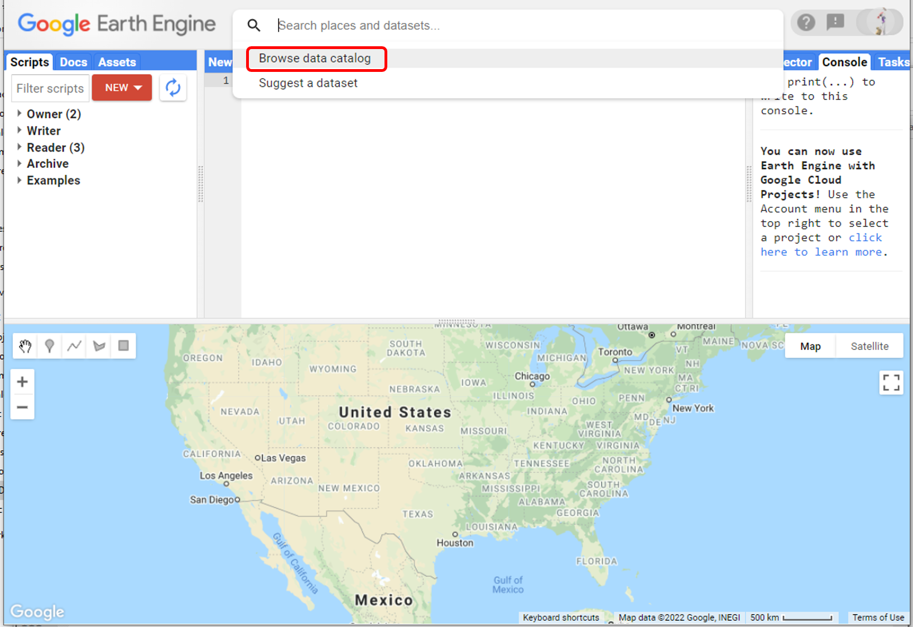

3. This will take you to the data catalogue webpage where you can click on "view all datasets" to browse all the datasets. You will find there are plenty of datasets and probably this is not the most efficient way of looking for a dataset. 

4. Now go back to the GEE and we will look for the dataset using the search button. Can you remember the name of some of the satellites that you heard/learnt in your lecture? Does "Landsat" ring a bell? Type in "Landsat" in the search bar. You can hit enter on your keyboard to view all the datasets associated with "Landsat" while the most popular ones will be displayed to you without hitting the enter. Look at the different results and the categories of results you have.

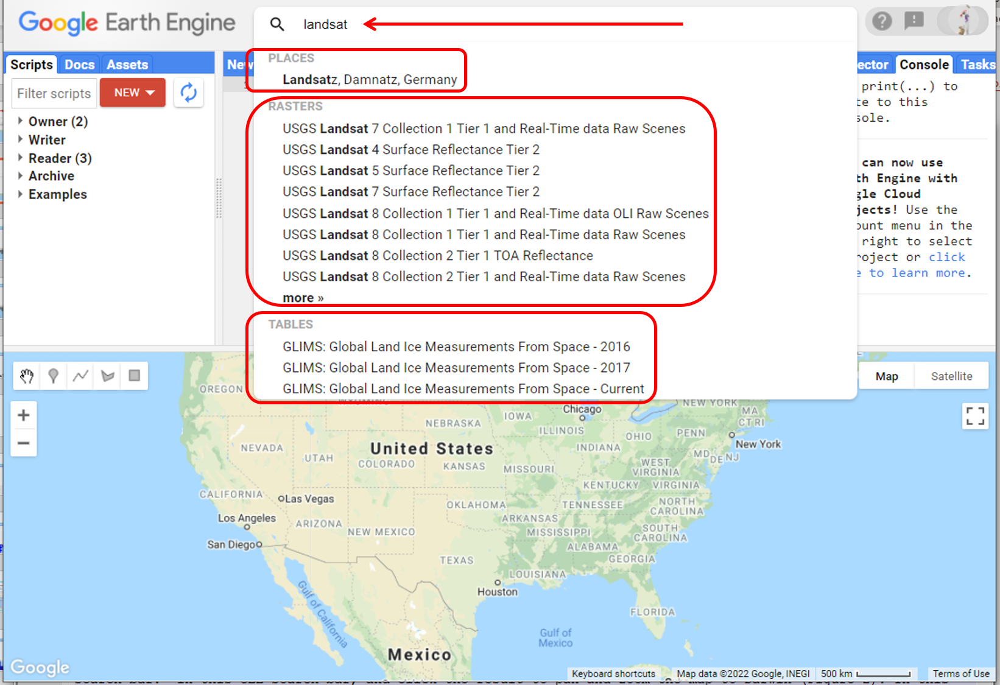
 
5. Three categories of results include "Places", "Rasters", and "Tables". Places display the addresses with the name. In the above example, Landsat is also a name of a place in Germany. Rasters list the satellite imageries with that name. In the above example, we have several Landsat rasters. Finally, the Tables displays other types of geographic datasets - these are called vector datasets. You may have learnt about vectors in other courses. If you are after images, you need to select the results under the "Rasters" category.  
 
6. Try to remember other satellites that were mentioned in the lecture. Try to search for them - can you find them in the GEE? 
 
**Question:** *Name three satellites that you think are most useful in the context of Earth Observation and see if the data * 

## 4. Finding information about a specific data/image

1. Now that we know how to search for a dataset, let's learn how to gather basic information about a particular dataset that we are interested in. The skill to look for basic information will be important for you in the upcoming Pracs and assignments when you need to modify the scripts. 

2. Type Sentinel-2 in your search bar and click on the Raster result called "Sentinel-2 MSI: MultiSpectral Instrument, Level-1C".
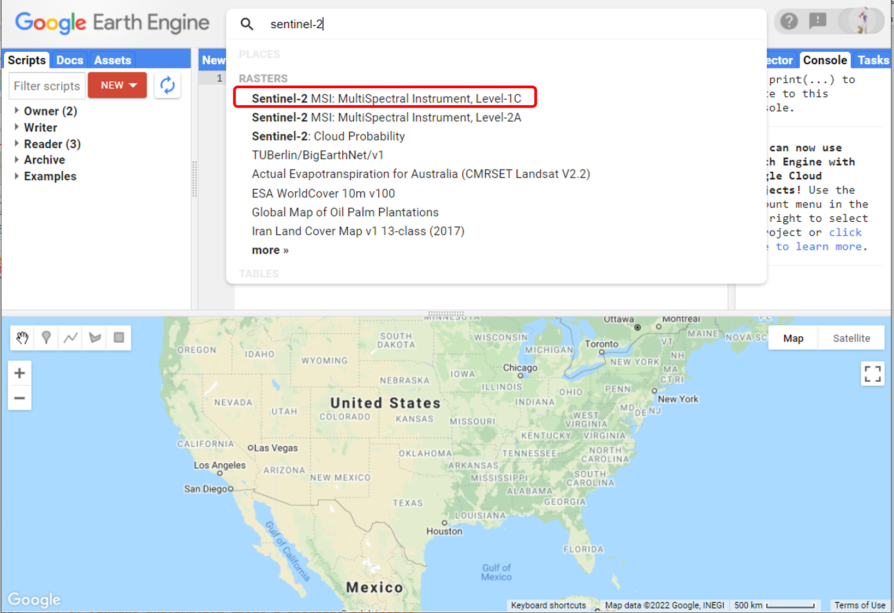

3. This will open up an information tab for the Sentinel-2 satellite. In the information tab, you can read about the satellite. Such as what is this satellite about and what is the data availability. In the below example, the Sentinel-2 data is available since the 23rd of June 2015. 

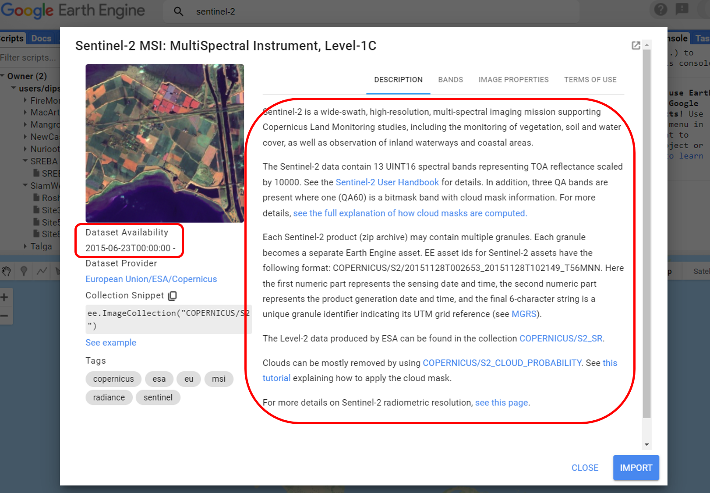
4. Now click on the "Bands" tab. This tab has all the information about the bands that Sentinel-2 images have. The name of the band is how the GEE understands which band we want to do certain computations on. For example, if we want our computation on the Blue band, we need to call it "B2" and so on. Note the number of spectral bands (from B1 to B12) and the spatial resolution of each band. The Sentinel-2 has 13 spectral bands with a spatial resolution of 10-60 metres. Additionally, the table also contains information on the wavelength of each band and the scale. The scale represents how the reflectance values are stored in the image. In the above example, the scale is 0.0001, this means reflectance values (normally stored in the range of 0-1) are stored in the range 0-1/0.0001 i.e. 0-10000. 

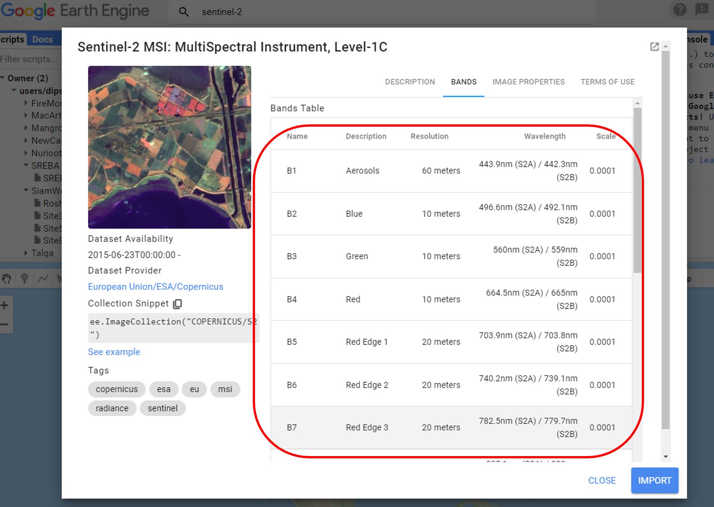

5. Now look into the "Image Properties" tab. Here you can find information about different metadata information that you can use in your computation. For example, can you find a property called "CLOUD_COVERAGE_ASSESSMENT"? This variable stores value as an assessment of how cloudy a particular image is. Using this variable, we can quantitively tell how cloudy our image is - we will use these properties later in future pracs.  

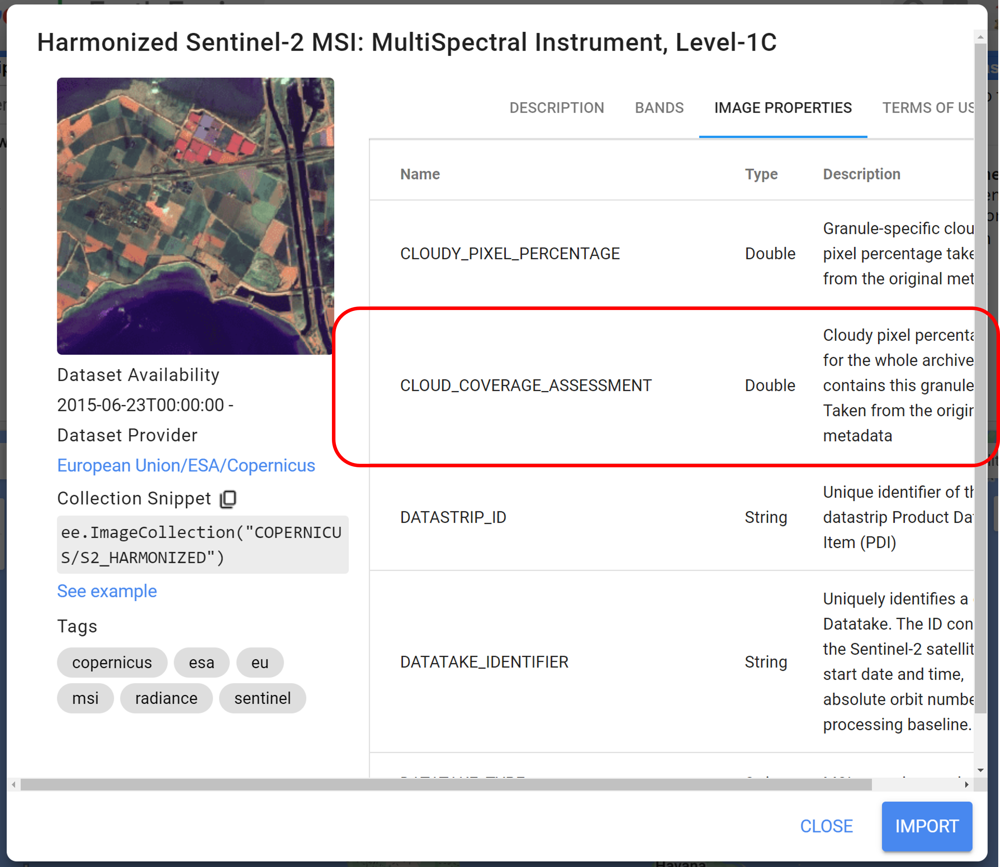

6. Now you can hit close. You know how to look for and find satellite data and information associated with the image. 

**Question:** *Using the above technique, try finding the data availability, band name, spatial resolution, and wavelength of Landsat-8 images.*

7. Note not all satellite data is available in the GEE and not all the information may be written in the GEE information window. So, for further information, you will need to do a google search. 

8. You can close the window - you don't need to save this weeks script.

## 5. Single band image visualisation

1. Now we are ready to work with the Earth Observation images. First we will work with a single band images and use the NASA SRTM Digital Elevation as an example. The SRTM is actually a radar data that has been converted to raster, so, you can access the data as any other images. The data contains elevation of our entire globe sampled at 30 m resolution. Note that this data was captured back in 2000. 

2. Let's navigate to the Eastern side of Victoria where we have some terrain features which will be interesting for this prac. Use your mouse left click and drag on the mapping area to pan to Melbourne. You can use the mouse wheel or + - button to zoom in or out. The navigation in the mapping pane is very much like google maps. I want you to navigate to Mount Buller region. Alternatively you can search for Mount Buller in your search bar to navigate to the region.

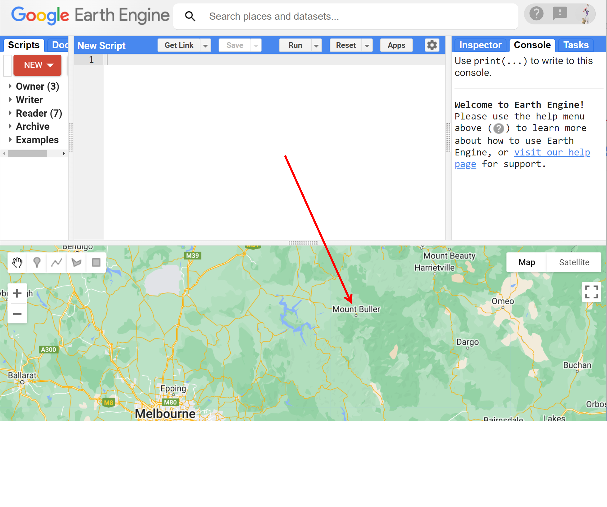

3. Now let's search for an elevation dataset. In the search bar, type in "elevation" or "SRTM" and click on the "NASA SRTM Digital Elevation 30m" result to show the dataset description. To learn more about this dataset, check out the blurb and associated resources in the Canvas shell.

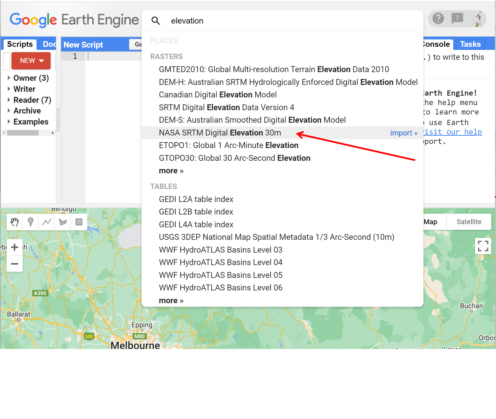

4. View the information on the dataset - read under "description" and "bands". Once you are happy, click on "Import", which imports the image to the Imports section at the top of your script.

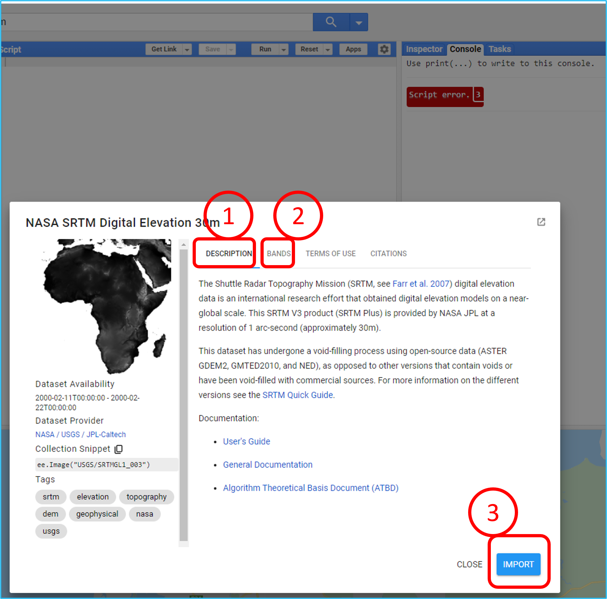

**Question:** *How many bands did this data have and what are their spatial resolution?*

5. Rename the default variable name "image" to anything you like. The naming convention is that the name should be short but descriptive enough for you to understand when you revisit this script later in the future. Here I will rename the image "theSRTM". 

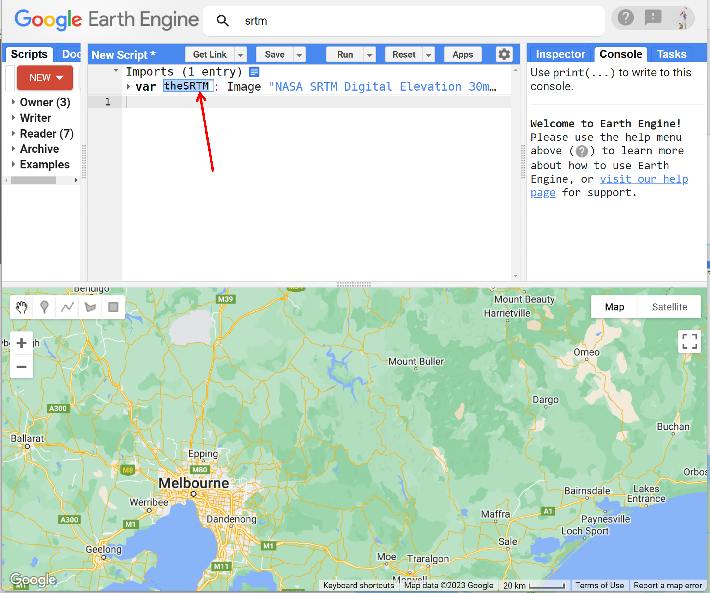

6. We used the print command in above section as well as learnt about metadata. Now, using print command and passing in the image variable, you can print the metadata about that image. Use print command to print the image object to the console by copying the script below into the code editor, and clicking "run" :

```JavaScript
// print the image information to the console
print(theSRTM);
```
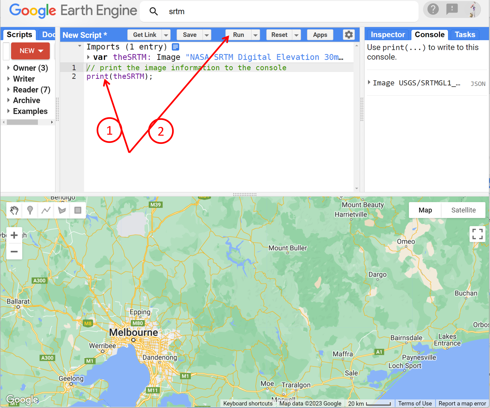

7. The print command just prints the metadata information, not the image. Browse through the information that was printed to the console window. Open the “bands” section to show the band named “elevation”. Note that all this same information is automatically available for all variables in the Imports section.

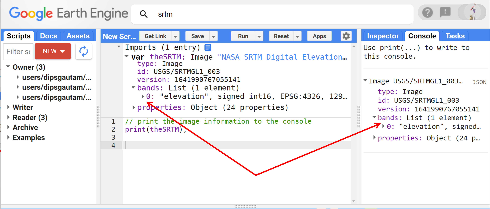

8. Always know that you can look into the image description or printed information, or within the import section to look into more detail about the image. 

**Question**: *From the image information that is printed to you, and the description window that was available to you, can you tell: how many bands does this image have, when this image was acquired, what is the spatial resolution of all the bands, what are the name of all the bands?*

9. To display the image in your mapping layer, you will need to use the Map.addLayer() command. Lets start with simple display (without using any of the optional parameters) and build our way towards a comprehensive display. Use script below to add the image to the mapping layer.  


```JavaScript
// Add default display to the mapping layer
Map.addLayer(theSRTM);
```

10. The displayed image looks pretty flat grey because the default visualization parameters is displaying the images in a full 16bit range of the data, but the elevation range is much smaller than that in any particular location. We’ll fix it in a moment.

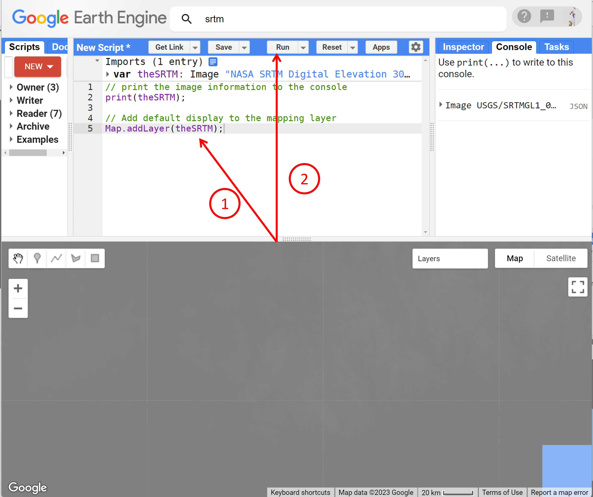

11. To get a feeling for the range of elevation (min and max) for proper display, we can query the map to see what elevation looks like on a selected pixel. Select the Inspector tab. Then click on several points on the map to get a feel for the elevation range in this area.

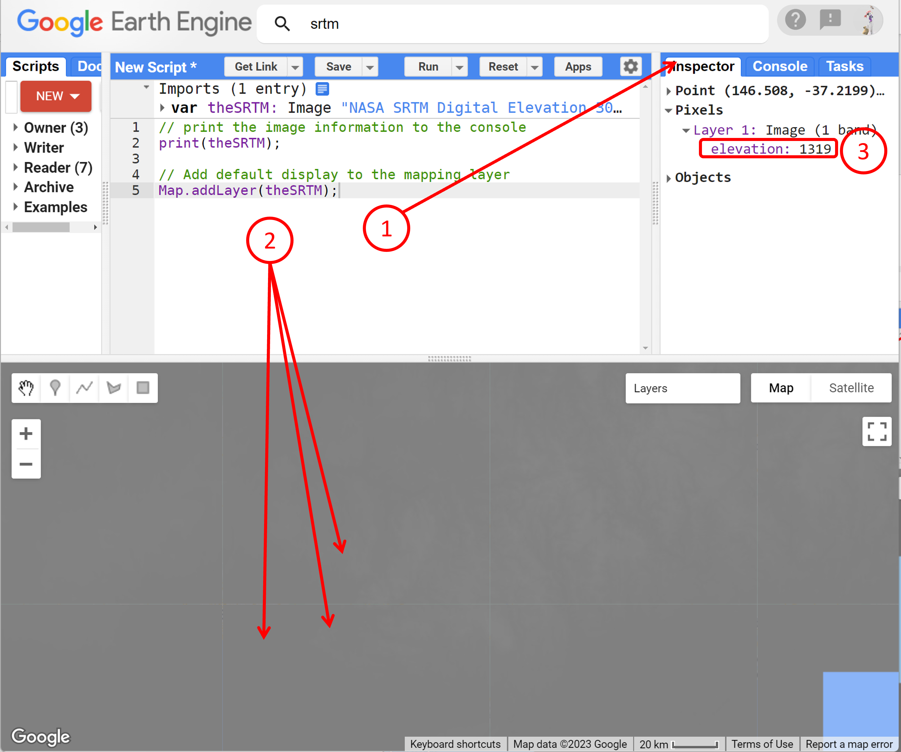

12. Now you can set some more appropriate visualization parameters by adjusting the code as follows (units of the min and max values are in meters above sea level). The method scaling the pixel values to ehnance the visual perception of an image is called image stretching.  What we are doing in below example is displaying any elevation 0 m or lower as darkest and any value 1300 m or above as brightest, all the values between 0 m - 1300 m are displayed in a linear gradient of brightness. There are other methods of image stretching Changing the range of min and max is a technique called image stretching. There are many methods to stretch an image - if you are interested, do a google search for further read.  

```JavaScript
// Display with adjusted min/max values
Map.addLayer(theSRTM, {min:0, max:1300});

```
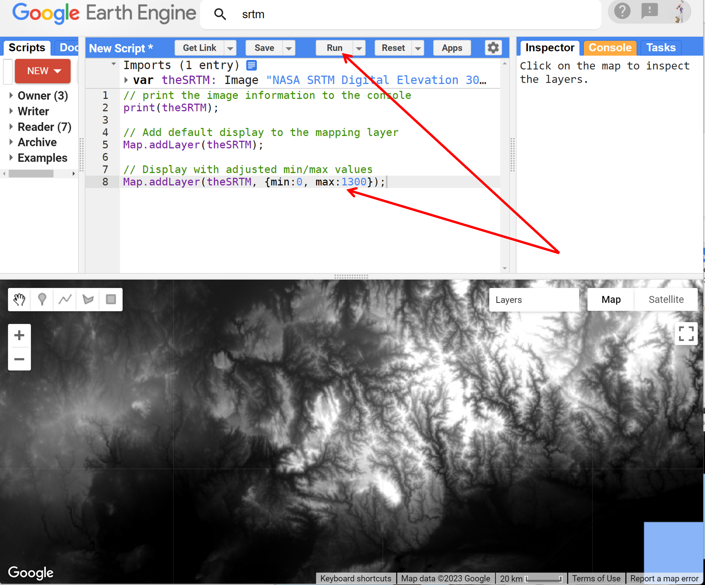

13. You will now be able to see the variation in the elevation range with low elevation landscapes in black and the high elevation landscape in white pixels. Layers added to the map will have default names like "Layer 1", "Layer 2", etc. To improve the readability, we can give each layer a human-readable name, by adding a title with the syntax in the following code. Don't forget to click run.

```JavaScript
// Display with min/max and layer title
Map.addLayer(theSRTM, {min: 0, max: 1300}, 'Elevation above sea level');
```
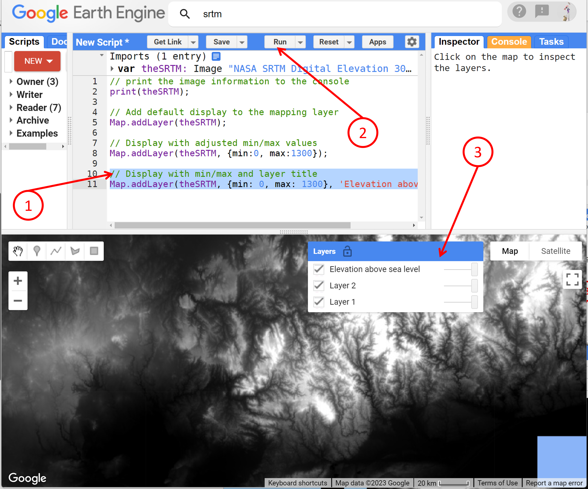

14. Now you can also add the colour palette to make the elevation map look colourful and beautiful. Experiment with different colour combinations by changing/setting the palettes as per the example below. In the below example, lower elevations closer to the min value (0 m) are assigned to blue colour, higher elevations closer to max value (1300 m) are assigned to red colour, and the medium elevation closer to 650 m elevation are assigned to yellow colour. Note that you can create as many color palette as you want. 

```Javascript
// Display with min/max, layer title, and color scale
Map.addLayer(theSRTM, {min: 0, max: 1300, palette: ['blue', 'yellow', 'red']}, 'Color scale elevation above sea level');
```
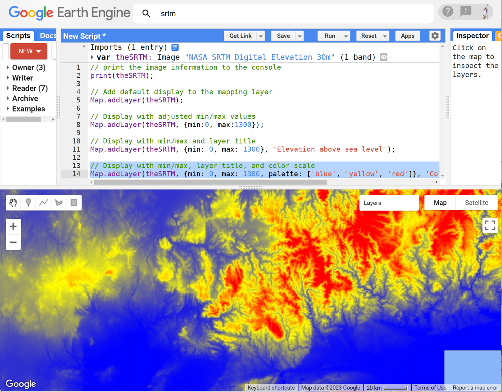

15. Below is the draped view that I created which I think looks great for any reports. I created the view by 1) disabling all the layer that you dont need, 2) changing opacity of your display layer, 3) enabling terrain view on your map.


16. That's how you display the single band image. There are several computation specific to elevation map that you can perform in GEE - but we are not going to go there. If you are interested check out the commands in Docs tab under ee.Terrain and feel free to discuss with me. In fact, Docs tab is your friend when you need help and want to learn more about commands.


17. Note that JavaScript (or any other script) is strict in syntax, any error in syntax means the script won't run. For example, if you forgot to type a single ' or , or : or ) or ( in the above script, the script won't run. If you typed "map.addLayer" instead of "Map.addLayer", the script will not work. Just remember that if your script is not working, most often the error lies in the syntax. You can now comment out all the intermediatory steps we took to get to our final display.

18. Don't forget to save your script. Click on Save button or use CTRL+S in the windows computer (Command+S in Mac) to save your script. 

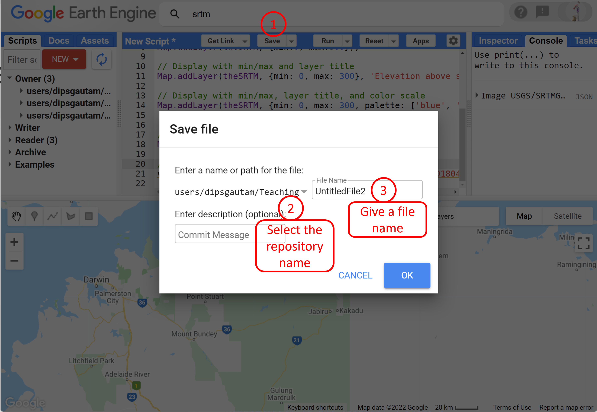

**Question**: *Now, I want you to zoom out of the current view and navigate to different places around the globe where you may find interesting landscape features. You will learn that whenever you navigate to new area, the min/max value in your visualisation parameter needs to be changed. Some suggestion for you to have a look at are - the Kakadu national park near Darwin, NT; the Tibetan Pleatue and Himalayan range, and your home town. Have fun.* 

## 6. Visualising the multi-band image

1. For the visualisation of multi-band images, we will use a multi-spectral image collected by the European Space Agency's Sentinel-2 satellite. Sentinel-2 is a wide-swath, high-resolution, multi-spectral imaging mission supporting Copernicus Land Monitoring studies, including the monitoring of vegetation, soil and water cover, as well as observation of inland waterways and coastal areas. For this part of the Prac we will work with the image captured over Kakadu National Park, NT, Australia.

2. Let's navigate to the area of interest (Kakadu) by copying the code below into the Code Editor and clicking "Run". Remember that the line starting with // is a note to ourselves and others, and is not processed (we call this a comment). The numbers in brackets are the longitude, latitude, and zoom level (range is from 1 to 22). This is another way of navigation to a known location - previously we navigated by using our mouse or searching for the name of the place. You can tick on/off the existing elevation layers as you need.

```JavaScript
//Navigate to the area of interest
Map.setCenter(132.5685, -12.6312, 8);
```

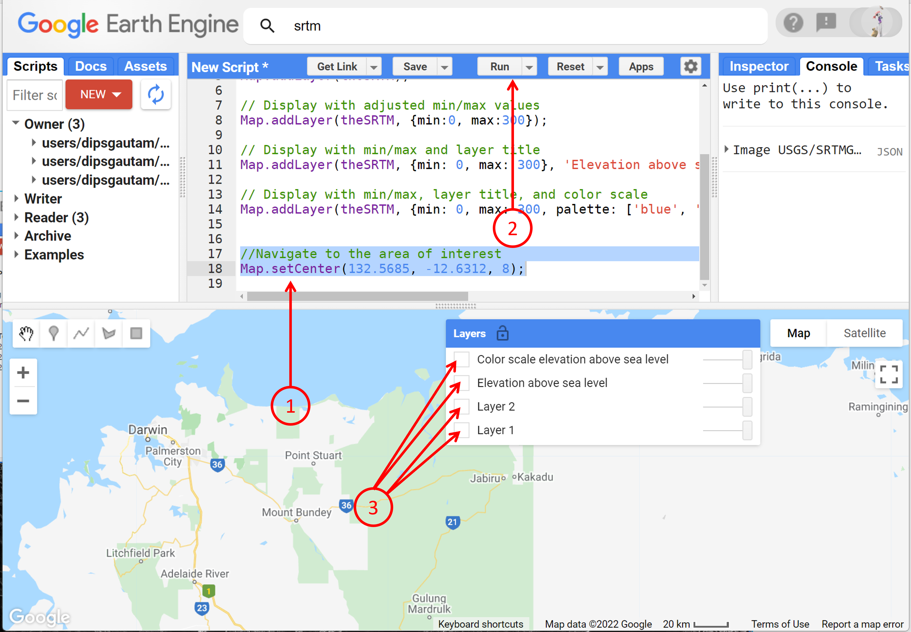

3. Now that we are in the right place, let's choose a Sentinel-2 image using the code below. Copy and paste into the Code Editor. Copernicus refers to the satellite mission, S2 is short for Sentinel-2, and the long number 20180422T012719_20180422T012714_T52LHM refers to a specific image, defined by date, time and a path and row of the satellite's orbit. Note that I have chosen a single image for this Prac, but we will cover searching for images for specific areas and dates at a later stage. 

```JavaScript
// Select a specific Sentinel-2 image from the archive
var anImage = ee.Image("COPERNICUS/S2/20180422T012719_20180422T012714_T52LHM");
```

4. Running the above script does not do anything visibly new. It simply has imported the Sentinel-2 image into our script. We have done a printing of image information for the SRTM image. Now, I want you to print the image information for the above Sentinel-2 image. (Hint - the SRTM image was referred to as "theSRTM", the Sentinel-2 image is referred to as "anImage"). 

**Question: ***How many bands do the above Sentinel-2 Image have, what are they and what are their spatial resolution and spectral position?*

**Question: ***How are the Red, Green, and Blue bands called in the above Sentinel-2 image?*

5. Bands 2, 3 and 4 are the blue, green and red bands respectively. Therefore if we wish to view a true-colour rendering of the image - i.e. an RGB composite, we need to place Band 4 into the red channel, Band 3 into the green channel, and Band 2 into the blue channel. We can do this with the code below - take careful note of the syntax for specifying the band arrangement.

```JavaScript
// Add RGB composite to map
Map.addLayer(anImage,{bands:['B4','B3','B2'], min:0, max:3000}, "True-colour");
```

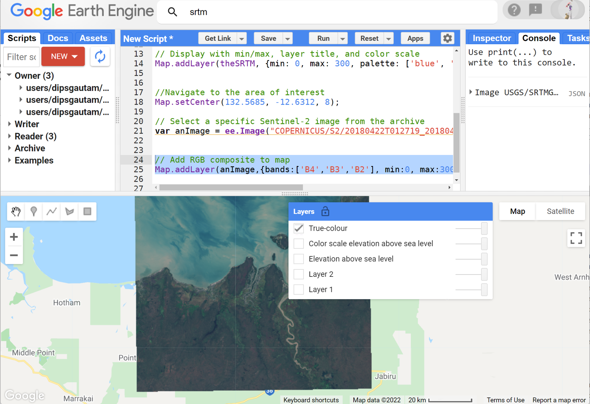

6. **Take a moment** to play with and understand the above Map.addLayer script. This is super important. Also compare with the Map.addLayer script we used for single band image. Note the differences in the syntax for the single- and multi-band image: in the single band image, we don't need to define "bands" which we need to do for multi-band image (otherwise GEE won't know which band to display for us). The colour in the single band image comes from how we define "palettes" whereas the colour in multi-band image comes from the order in which the 3 bands are fed in (i.e. Red first, Green second, and Blue last results in RGB display). 
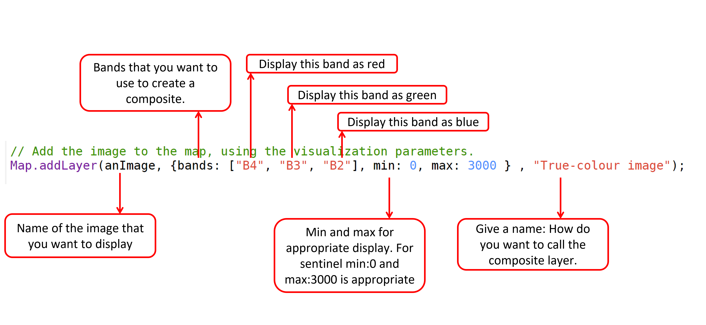

7. The min/max of 0-3000 is about right for the Sentinel-2 - this results in a view similar to what we would see looking out of the window of an aeroplane. You can play with the min/max value to see the change in contrast. The band combination ['B4','B3','B2'] displays the RGB composite. Zoom in a bit closer using the wheel of your mouse. These images are a fantastic resource for environmental mapping and monitoring. The visible spectrum bands are at 10 m spatial resolution, and the revisit time of the satellite constellation is every 6 days in this region. Thanks, ESA!

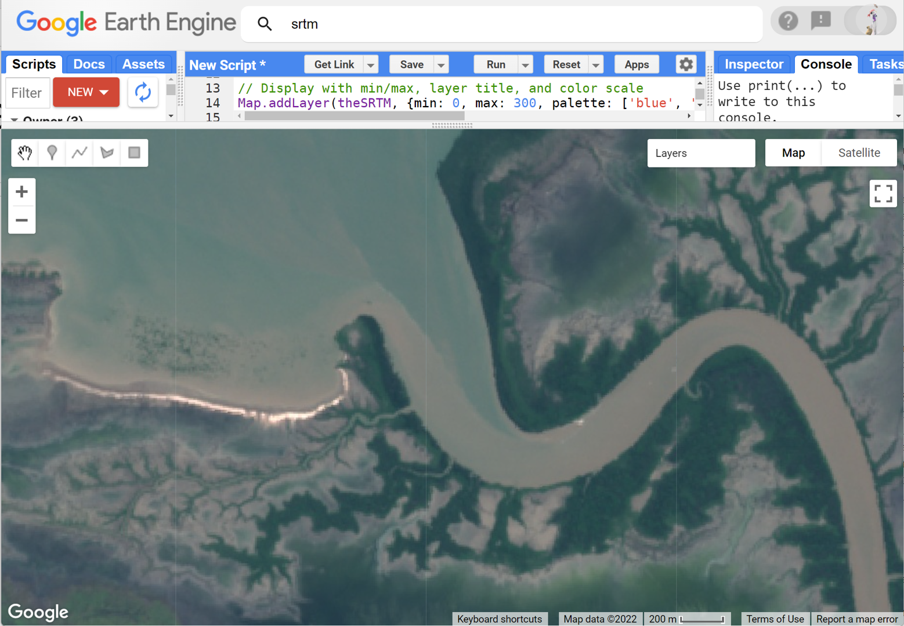

8. Interpret the image taking into consideration when the image was captured. In the wet season, Northern Australia is vibrant with photosynthetically active vegetations, the surge in flood plains and water bodies. While in the dry season, the vegetation dries up,  bush fire takes hold, and water bodies retreat. 

##7. Color composite and band combination

1. Different landcover types on the earth surface such as water, forest, grassland, desert, bare land etc interact differently with electromagnetic energy. These features absorb and reflect different amount of electromagnetic energy. As a result, the spectral information recorded by the satellite for those landcover types varies. For example, the spectral value in the near-infrared region for vegetation is quite high while for the water is quite low. To find out more about how different landcover interact with the electromagnetic energy, you can use the Inspector tool which is located in the Console Panel - left hand tab. Click on the Inspector tab and then click on the image in the map view. The satellite recorded band values for the pixel you clicked will be displayed in the Inspector window. Navigate the displayed true color composite and inspect pixels associated with vegetation, water, and baresoil. Using screen capture, place the three histograms (as below) together and think about why and how their band reflectance values differ. 


2. In the above example, I clicked on the bare soil looking feature. The band values represented the spectral characterstics of the bare soil whose reflectance increases with the wavelength. The drop in the reflectance in B12 represents the soil moisture content. Note this image was taken at the end of wet season in the Northern Territory. The landscape at that point is expected to be mostly wet. 
**Question: ***What does the spectral characterstic look like for vegetation pixel and why do you think that is?* 

3. Sometimes the landscape features are not super clear when viewed in true color composit. Because there could be high contrast when you include other bands. For example, in terms of vegetation, the high contrast exists between the high reflectance NIR bands and high absorption Red band. Thus color composite trying to highlight vegetation tend to use one or both of the NIR and Red band. One such classical false color composite utilises NIR, Red and Green band to highlight photosynthetically active vegation in red color. In the below false-colour infrared composite example, the NIR band is displayed in red colour, the red band is displayed in green colour and the green band is displayed in blue colour. 


```JavaScript
//Define false-colour visualization parameters.
var falseInfraredViz = {
  bands: ["B8", "B4", "B3"],
  min: 0,
  max: 3000
  };

// Add the image to the map, using the visualization parameters.
Map.addLayer(anImage, falseInfraredViz, "false-color composite");
```
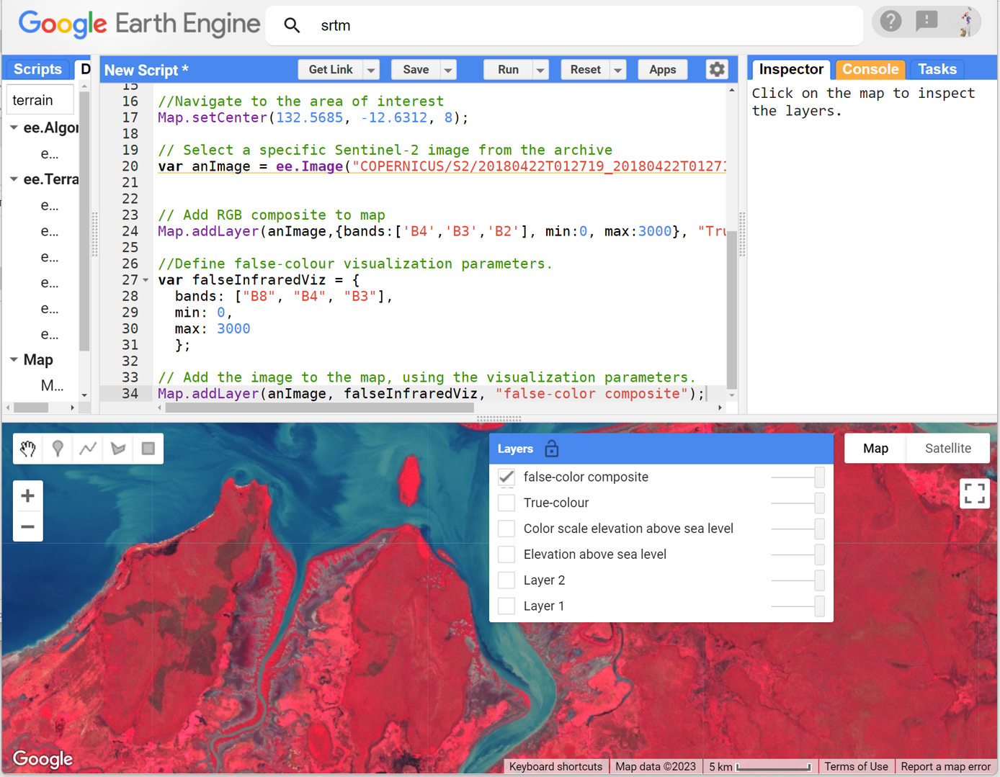

**Question*** We know that vegetation looks green. In the above false-colour infrared composite, the green band is displayed as blue colour. That means green vegetation should have appeared as blue colour. Why instead vegetation appears as red colour?*

4. The above false-colour infrared composites place the near infra-red band in the red channel. Chlorophyll content in green leaves has a strong response in the NIR band. Vegetation that appears dark green in true colour thus appears bright red in the false colour. Note the variations in red that can be seen in the vegetation bordering the water bodies. Sometimes those within vegetation contrast may not appear clearly on the true colour composite. This variation could represent different level of biomass or health of the vegetation at that location.

5. Let's do one more false colour composite and you can practice the rest. I am going to do the land/water false-colour composite. This composite uses the following bands: NIR (B8), SWIR(B11), and Red(B4). Theoretically, we know that water abosrbs most of the electromagnetic radiation more absorption happens at the longer wavelength. So, in the combination of NIR, SWIR, Red, the water would typically appear dark or blueish due to small but relatively large reflectance in Red. 
 

```JavaScript
//Define land/water false-colour visualization parameters.
var falseLandWaterViz= {
  bands: ["B8", "B11", "B4"],
  min: 0,
  max: 3000,
  };

// Add the image to the map, using the visualization parameters.
Map.addLayer(anImage, falseLandWaterViz, "false-color Land/Water");
```


6. Now I would like you to try out different color composites and see what combination could be useful to highlight different features in landscape. In [this link](https://gisgeography.com/sentinel-2-bands-combinations/) you will find some color combination for Sentinel 2 - dont worry about the one that use band arithmetics, we will learn them later. 

## 8. Complete script 
```JavaScript
// print the image information to the console
print(theSRTM);

// Add default display to the mapping layer
Map.addLayer(theSRTM);

// Display with adjusted min/max values
Map.addLayer(theSRTM, {min:0, max:1300});

// Display with min/max and layer title
Map.addLayer(theSRTM, {min: 0, max: 1300}, 'Elevation above sea level');

// Display with min/max, layer title, and color scale
Map.addLayer(theSRTM, {min: 0, max: 1300, palette: ['blue', 'yellow', 'red']}, 'Color scale elevation above sea level');

//Navigate to the area of interest
Map.setCenter(132.5685, -12.6312, 8);

// Select a specific Sentinel-2 image from the archive
var anImage = ee.Image("COPERNICUS/S2/20180422T012719_20180422T012714_T52LHM");


// Add RGB composite to map
Map.addLayer(anImage,{bands:['B4','B3','B2'], min:0, max:3000}, "True-colour");

//Define false-colour visualization parameters.
var falseInfraredViz = {
  bands: ["B8", "B4", "B3"],
  min: 0,
  max: 3000
  };

// Add the image to the map, using the visualization parameters.
Map.addLayer(anImage, falseInfraredViz, "false-color composite");

//Define land/water false-colour visualization parameters.
var falseLandWaterViz= {
  bands: ["B8", "B11", "B4"],
  min: 0,
  max: 3000,
  };

// Add the image to the map, using the visualization parameters.
Map.addLayer(anImage, falseLandWaterViz, "false-color Land/Water");
```
-------
### Summary
Today is the first module of your journey in using Earth Engine for Earth Observation. Today we covered the very basics of the GEE interface, learnt basic JavaScript, and learned how to search for and find a broad range of remotely sensed datasets, learnt how to visualise single- and multi-band images and then learnt how to produce our own color combination. Next module we will look into a indices and spectral reflectance images. 

I hope you found this prac useful. I encourage you to play with the script, make changes, and make mistakes. A recorded video of this prac can be found on your Canvas shell.
### Thank you
#### Kind regards, Deepak Gautam
------
### The end
