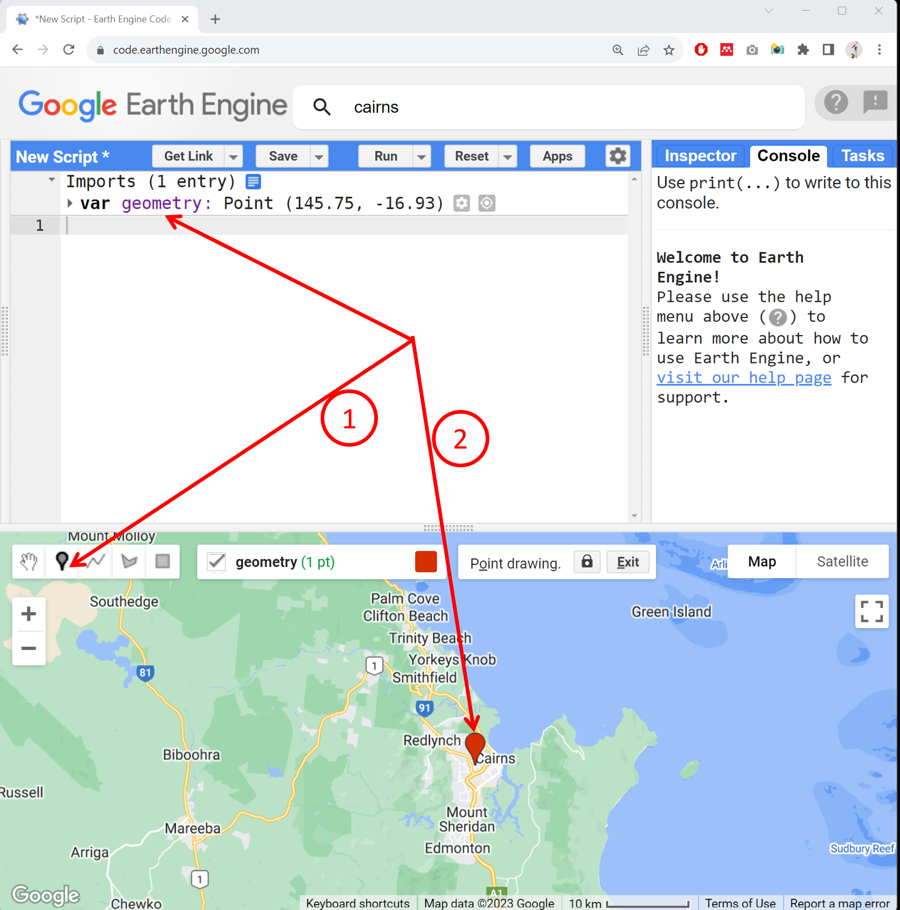
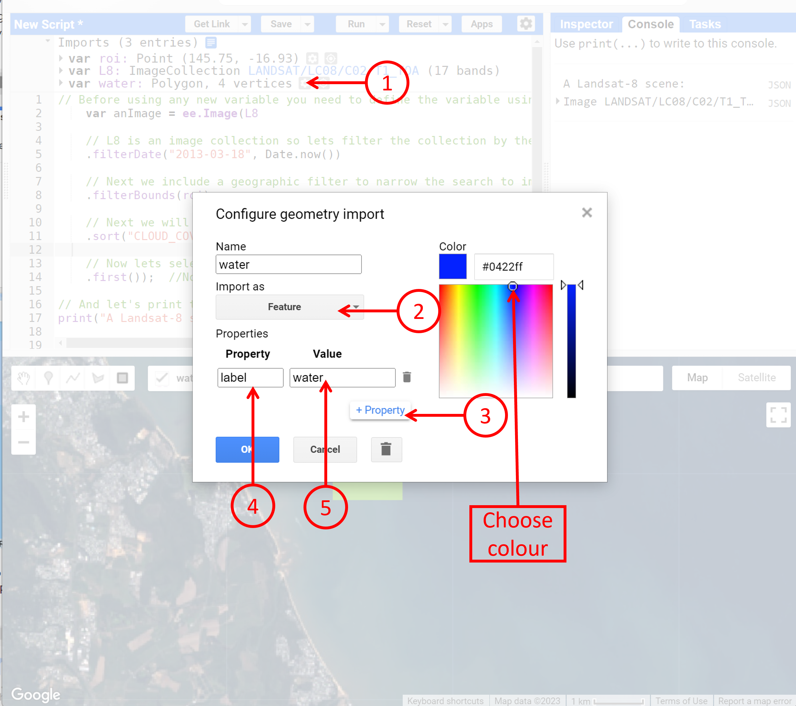

# Earth Observation Science (GEOM2084)
Module 2 Prac - Spectral reflectance and indices


### Acknowledgments 
- [Earth Engine Beginning Curriculum](https://docs.google.com/document/d/1ZxRKMie8dfTvBmUNOO0TFMkd7ELGWf3WjX0JvESZdOE/edit#!)
- [Google Earth Engine guide](https://developers.google.com/earth-engine/guides)

### Learning objectives
The learning objectives of this Module are:
- to filter through the historical archive of Earth Observation images to find a cloud-free image.
- to extract and critically assess the spectral reflectance of landscape features. 
- to compute and interpret the spectral indices for landscape features.

---------------------------------------------------
## 1. Accessing image collection

1. Just above the Coding panel in the search bar. Search for ‘Cairns’ in this GEE search bar, and click the result to pan and zoom the map to Cairns. Note the results populated under the "places" refers to the actual location on earth.


2. Now, let's make use of the geometry tool available to us in GEE. There is marker geometry (to define a point), line geometry (to define a line), shape geometry (to define a polygon with any number of sides) and rectangle geometry (to define a rectangle). Let's use the marker geometry to create a point on the Cairns CBD. You need to click on the marker geometry and then click on where you want to create the point. Once you create the point, you will see the point geometry being added to your Coding panel as a variable (var) under the Imports heading. The use of this marker will come in later when we want to access the image from this location.




3. Rename the default name of the point ‘geometry’ to any name you want. Let's call it ‘roi’ (roi means "region of interest"). Rename by clicking the import name ‘geometry’ to 'roi'.


4. Search for ‘Landsat-8’ in the search bar. In the results section, you will see ‘USGS Landsat 8 Collection 2 Tier 1 TOA Reflectance’ - click on it and then click the ‘Import’ button. Here, from previous pracs, you know that the detailed information of the image is available to you in the description window. 


5. After clicking import, Landsat-8 will be added to our Imports in the Coding panel as a variable. It will be listed below our campus geometry point with the default name "imageCollection". Let's rename this "imageCollection" to “L8” by clicking on it and typing "L8". Note that you can rename it to any name you want. 


6. It is important to understand that we have now added access to the full Landsat-8 image collection (i.e. every image that has been collected to date) to our script. For this exercise we don't want to load all these images - we want a single cloud-free image over Cairns region. As such, we can now filter the image collection with a few criteria, such as time of acquisition, spatial location and cloud cover.


## 2. Filtering through the historical archive

1. To achieve this filtering we need to use a bit of coding. In the JavaScript, two backslashes (//) indicate comment lines and are ignored in actual processing steps. We use // to write notes to ourselves in our code, so that we (and others who might want to use our code) can understand why we have done certain things. 

```JavaScript
// Before using any new variable you need to define the variable using command "var" as below
    var anImage = ee.Image(L8

    // L8 is an image collection so lets filter the collection by the the date range we are interested in
    .filterDate("2013-03-18", Date.now())

    // Next we include a geographic filter to narrow the search to images at the location of our point
    .filterBounds(roi)

    // Next we will also sort the collection by a metadata property, in our case cloud cover is a very useful one
    .sort("CLOUD_COVER")
	
    // Now lets select the first image out of this collection - i.e. the least cloudy image in the date range and over the Cairns
    .first());  //Note that upto here was one line of script, hence, no use colon

// And let's print the image to the Console.
print("A Landsat-8 scene:", anImage);
```

2. You need to copy the entire code above and paste it into the GEE code editor. Then click the "Run" button and watch Earth Engine do its magic...... This code will search the full Landsat-8 archive (2013 to present), look for images acquired over the Cairns region, sort them according to the percentage cloud cover, and then return the least cloudy image for us. Information relating to this image will be printed to the Console, where it is listed as "A Landsat-8 scene" with some details about that scene(LANDSAT/LC08/C02/T1_TOA/LC08_096072_20130702). We know from the image ID that it was collected on the 2nd July 2013. (Note you may end up with a different cloud-free image)


3. **Take a moment** to play with and understand the above filtering script. Use the figure below as a guide


4. **Self-assessment questions:** Try modifying the above script to answer the questions. Discuss in the discussion board with your classmates if you are stuck. 
- *What do the numbers within the filterDate() represent?* 
- *Think about what would happen if you removed or commented out the filterDate command?*
- *Modify the above script to get an image from last - month. Can you do that?*
- *What does filterBounds represent?*
- *What will happen if you remove or comment out the filterBounds() command.*
- *Where did we get the keyword "CLOUD_COVER" to sort the images.*
- *What will happen if you remove the ".first()" command?*
- *How many Landsat-8 images has been collected since the launch of Landsat-8 and until the end of last year?*
- *How many times has the roi been captured in the Landsat-8 mission until the end of last year?*
- *How many images does Landsat-8 collect in a day?*
- *How many images does Landsat-8 require to cover the entire planet?*


5. Now we have refined the entire image collection to a single image called "anImage". To view this image, we need to add it to our mapping layer. Before doing that, however, let's define how we want to display the image. Let’s start with a true colour representation by adding the following lines of script and clicking "Run".

```JavaScript
// Define visualization parameters in a JavaScript dictionary for true colour rendering. Bands 4,3 and 2 needed for RGB.
var trueViz = {
  bands: ["B4", "B3", "B2"],
  min: 0,
  max: 0.3
  };

// Add the image to the map, using the visualisation parameters.
Map.addLayer(anImage, trueViz, "true-colour image");
```

**Note:** *The above script could have also been written as: -Map.addLayer(anImage, {bands: ["B4", "B3", "B2"], min: 0, max: 0.3 }, "true-colour image");  ... However, we have defined a variable called trueViz and plugged in that variable in the Map.addLayer command*

6. Above script specifies that bands 4,3 and 2 should be used in the RGB composite for a true colour image. After the image appears on the map, you can zoom in and explore Cairns region. We see great detail in the Landsat-8 image, which is at 30m resolution for the selected bands. 


7. Try moving your marker geometry to a different location (e.g. to Melbourne), run the script and see what happens... You should get a cloud-free image from Melbourne. So, you now have the skills to look for images from anywhere in the globe (by moving your geometry) and from the desired time range (by adjusting the start and end date in the filtering script). Please practice and once you are happy with the filtering and displaying of images, move the marker back to the Cairns region for the steps to follow.


## 3. Defining geometry regions of different landcover to plot the reflectance curve

1. Alright, now that we have found the image we want to work with, let's define the regions for different landcover that we want to plot the spectral reflectance curve of. Here, let's work with the following landcover types: forest, urban, water, bare land, and agriculture. Hover over the "Geometry Imports", click on ‘new layer’, select the rectangle geometry and draw a rectangular polygon over the waters. After you are done, rename the "geometry" to  "water".


2. To plot the spectral reflectance curve, we need to change the geometry to feature. Click on the gear icon (settings) next to the water variable in our imported headings. Then, change the 'Import as'  from 'Geometry' to 'Feature'. Use '+ property' and define Property as 'label' and value as the name of the class (e.g. water, urban, forest). Be consistent in the spelling, upper/lower case. 



3. Now repeat the above step 1 and 2 for other landcover types: forest, urban, bare land, and agriculture. By the end, you should have five landcover types defined as below. Note that having more than one polygons for each landcover type is alright.


## 4. Plotting the spectral reflectance curve

1. Now specify the bands that you want to use to construct the spectral reflectance curve. The Landsat-8 has 11 bands. You can use all the available bands or use selected bands. Look into the available bands and think about if some bands are useful for a specific landcover type. In the script below, I have used bands 2-7 which include the blue, green, red, NIR, SWIR1 and SWIR2, which suffice for the landcover type we are interested in.

```JavaScript
//Choose bands that you want to include in the spectral reflectance curve 
var bandsToPlot = anImage.select('B[2-7]'); 
```


2. We want to chart the spectral reflectance curve of the 5 landcover types together, so, we need to merge all the 5 landcover features into a feature collection. Use the script below. 

```JavaScript
// Define the feature collection to use to extract the spectral reflectance curve
var landCoverRegions = ee.FeatureCollection([water,forest,urban,bareland,agriculture ]);
```
3. Now we can create a chart variable and then print the chart to the Console. We use the image.regions function to summarise by landcover class region, and the ee.Reducer.mean() function to obtain the mean reflectance value for each landcover class for each band.


```JavaScript
// Create the reflectance chart
var reflectanceChart = ui.Chart.image.regions({
    image:bandsToPlot, // the image where to grab the reflectance data from
    regions:landCoverRegions, // the regions within the image to sample from
    reducer:ee.Reducer.mean(), // the reducer here we compute mean reflectance
    seriesProperty: 'label'}); // use the labelproperty we defined earlier as the legend

// Now print the chart. You need to print to see the chart
print(reflectanceChart);

```


4. The script prints the reflectance chart into the Console. You can view the chart in the Console or expand the chart into a new tab to view and interact with the chart. You also have the option to download the chart data into CSV format or download the chart figure.


**Question:** *Why does the urban chart have the characteristics of the vegetation chart? i.e. absorption in B4 (Red) and high reflectance in B5 (NIR)?*
**Question:** *Why does the bareland chart has high reflectance in B6 and B7?*
**Question:** *Which landcover has more water content - sort in order - bareland, agriculture, forest, urban?*

5. Great we have a chart. We can download the chart data in CSV format and produce our desired graph in excel (you are encouraged to explore visualisation options in excel on your own). The chart in its current form is not easy to read. Let's improve the readability of the above chart by specifying correct labels and titles, ticks, colours, etc. Let's start by defining what x-axis ticks are going to be. e.g. instead of B1, B2, ..., B7 as in the above figure, let's use the actual band wavelengths on the x-axis using this:

```JavaScript
// Define a list of Landsat-8 wavelengths for the Bands 1-7 to display in X-axis labels.
var wavelengths = [482, 562, 655, 865, 1609, 2201];

```

**Question:** *Where did I get above wavelength values from?*

6. Now let's define all the other parameters (axis titles, line style, point style) using the script below
 
```JavaScript
// Define the axis labels, title, linewidth, pointsize and line color.
var plotOptions = {
  title: 'Landsat-8  Surface reflectance spectra', // title of the chart
  hAxis: {title: 'Wavelength (nanometers)'}, // horizontal axis title
  vAxis: {title: 'Reflectance'}, // vertical axis title
  lineWidth: 1, // width of the line in the chart
  pointSize: 4, // display the reflectance values using a poitn sized 4
  series: { // color of the different lines
    0: {color: 'blue'}, // Water chart in blue
    1: {color: 'green'}, // Forest chart in green
    2: {color: 'red'}, // Urban chart in red
    3: {color: 'yellow'}, // Bareland chart in yellow
    4: {color: 'purple'} // Agriculture chart in purple
}};

```

7. Okay now rechart the spectral reflectance curve (as we did in step 1). But this time around we will use all the chart parameters that we defined in above two steps.  

```JavaScript
// Create the reflectance chart
var reflectanceChart1 = ui.Chart.image.regions({
    image:bandsToPlot, // the image where to grab the reflectance data from
    regions:landCoverRegions, // the regions within the image to sample from
    reducer:ee.Reducer.mean(), // the reducer here we compute mean reflectance
    seriesProperty: 'label', // use the labelproperty we defined earlier as the legend
    xLabels: wavelengths}) // use wavelength value instead of B1--B7
    .setOptions(plotOptions);
// Now print the chart
print(reflectanceChart1);
```


8. On the chart's top right corner, you have a pop-up button (highlighted in the previous figure). Click on the button that will open the chart in the next chrome tab. In this tab, as we had earlier, an option to save the figure as PNG or download the raw chart data in CSV. 

9. Look into the chart and think about the spectral characteristics of different landcover types and how different wavelength interacts with the different landcover types. Refer to the lecture and reading materials to develop a detailed understanding. What do you learn from this chart? Do the spectral reflectance curve look similar to what we expect from our textbook understanding of the spectral reflectance curve. Do you see any anomalies (absorption/reflectance) that you find hard to understand? E.g. Why does agriculture have higher NIR reflectance compared to the forest? What factors do you think might induce errors in the spectral reflectance of different landcover? Is your ROI a true representation of the defined landcover - or could you do better? Remember that you can always use image enhancement to better visualise and thus better pick the features. 

## 5. Computation of normalised difference vegetation index
1. Now we will also use this same image to learn about spectral indices. We learnt about the NDVI index in our lecture. Here, we will learn how to compute and map the NDVI over a landscape region. First, do you recall the formula to compute the NDVI? The formula is (NIR-RED)/(NIR+RED).

2. Now, what you need to know is, to find out how the NIR and Red bands are called in Landsat-8 images. Find that out. Hint hint [image description window, Prac01].

3. Now we are ready to compute the NDVI, we need to use a function available in the GEE called "expression". To read more about the function, you can go to the Docs tab and search or find "ee.Image.expression".


4. You also need to have the ability to learn about specific functions/commands in GEE by simply googling it. The Google Earth Engine Reference has detailed explanations and examples for most of their functions. In future, if you are stuck with a specific command/function, make sure to look under the Docs tab as well as google it. 


5. Paste the following lines below the ones you’ve already added, and click "Run". NDVI values range from 0 to 1, and the higher the value the more "vigorous" the vegetation.

```JavaScript
//Define variable NDVI from equation
var ndviImage = anImage.expression(
  "(NIR - RED) / (NIR + RED)",
  {
    NIR: anImage.select("B5"),    // NIR band in Landsat is B5
    RED: anImage.select("B4")    // Red band in Landsat is B4
  });
```

6. If you run the script, you see nothing new happening. This is because we have computed the NDVI but have not asked to display it. To display the NDVI image, we need to use Map.addLayer command. Here, you can use the displaying skills you learned for a single band image in Prac02. The above computed "ndviImage" is a single band image containing NDVI values for each pixel. 

```JavaScript
// Add the NDVI image to the map, using the visualization parameters.
Map.addLayer(ndviImage, {min: 0, max: 1}, "NDVI");
```


7. That's our NDVI map, the darker pixel represents a lower NDVI value which is the absence of vegetation. The brighter pixel represents a higher NDVI value or abundance of photosynthetically active vegetation. However, the map is not easy to visually comprehend. Let's add a colour palette to our NDVI map. We have already learnt how to add a colour palette to a single band image. Let's do that here again. 

```JavaScript
// Add color palette to the NDVI image.
Map.addLayer(ndviImage, {min: -1, max: 1, palette: ['darkblue','blue','lightblue','red','yellow','green','darkgreen']}, "NDVI-colored");
```


8. Explore different parts of the image and see how NDVI values vary with different substrate types. The higher NDVI is displayed in green colour. The lower NDVI is displayed in red-yellow colour. The negative NDVI is presented in shades of blue. Earlier we ploted spectral reflectance curve of 5 landcover types. How do you think would those landcover displayed in the current NDVI display? Would urban be red? Whats yellow? Can you distinguish between urban and bareland? What about forest and agriculture? Perhaps you can if you add more color you think?

**Question***Now that you have the above script, how do you compute NDVI from a completely different region? Try it for yourself*

9. I can now move the roi geometry to anywhere in the globe to obtain the NDVI map from that region. Click, drag, and drop the geometry to move to a new location. In the below example, I have moved the roi to the Tully region of Queensland which has massive sugar cane and banana plantations. The bright green colour represents the healthy and vigorous plantation while the yellow and red colour could be the sparse or harvested plantation. 

10. I encourage you to play with the NDVI mapping, alter the date range, and explore regions that might be interesting to you - perhaps your hometown. And think about what could the colours represent. Once you are proficient with NDVI mapping, move the marker back to the Litchfield National Park region for the upcoming steps.  

## 6. Computation of normalised difference water index

1. We have learnt about NDWI in the lecture and you have reading material on NDWI available on your Canvas. Now, that we have a working NDVI script above, the easiest way to compute and map the NDWI is by borrowing the above script and making modifications where necessary. I encourage you to do the modification yourself. This is crucial in your learning process as well as completing the assignments. So, please complete the NDWI computation and mapping and check below if you have done it correctly.

2. First of all, what you need to figure out the formula for NDWI and the corresponding bands. By looking at the lecture, I can see the formula for NDWI is (NIR-SWIR)/(NIR+SWIR). That's great, but Landsat-8 has two SWIR bands at about 1600 and 2200 nanometers. So, check back on the NDWI reference to find out if you need to use the SWIR1 or SWIR2 band. 

3. Now, that you have identified the bands, you need to find out how those bands are referred to in GEE. Look into the data description window - under the bands tab. The NIR band is called "B5" and the SWIR1 band is called "B6". 

4. Now you are ready to copy the NDVI script from above and do the modification. Use the script below to check if you can make all the modifications independently.

```JavaScript
//Define variable NDWI from equation
var ndwiImage = anImage.expression(
  "(NIR - SWIR1) / (NIR + SWIR1)",
  {
    NIR: anImage.select("B5"),    // NIR band in Landsat is B5
    SWIR1: anImage.select("B6")    // SWIR1 band in Landsat is B6
  });

// Add a colour palette to the NDWI image.
Map.addLayer(ndwiImage, {min: -0.6, max: 0.6, palette: ['brown','red','lightblue','blue']}, "NDWI-colored");
```


5. NDWI is a measure of liquid water molecules in vegetation canopies. NDWI is sensitive to the total amounts of liquid water in the landscape including vegetation. For example, the agriculture is well-watered vegetation, so appears appear blue in the above image, the gradient of vegetation dryness is observed in lightblue to blue colours whereas the red and brown colours represent the driest of the landscape perhaps the bare land with sparse or no vegetation. In the above script, I have played around with the min and max to enhance the features in the landscapes. You can always alter them to enhance the contrast on specific features.

6. Don't forget to save your script.


## 7. Complete script 
```JavaScript
// this script is missing a) definition of ROI, b) import of Landsat-8 image collection, c) definition of the 5 landcover types. 

// Before using any new variable you need to define the variable using command "var" as below
    var anImage = ee.Image(L8

    // L8 is an image collection so lets filter the collection by the the date range we are interested in
    .filterDate("2013-03-18", Date.now())

    // Next we include a geographic filter to narrow the search to images at the location of our point
    .filterBounds(roi)

    // Next we will also sort the collection by a metadata property, in our case cloud cover is a very useful one
    .sort("CLOUD_COVER")
	
    // Now lets select the first image out of this collection - i.e. the least cloudy image in the date range and over the Cairns
    .first());  //Note that upto here was one line of script, hence, no use colon

// And let's print the image to the Console.
print("A Landsat-8 scene:", anImage);

// Define visualization parameters in a JavaScript dictionary for true colour rendering. Bands 4,3 and 2 needed for RGB.
var trueViz = {
  bands: ["B4", "B3", "B2"],
  min: 0,
  max: 0.3
  };

// Add the image to the map, using the visualization parameters.
Map.addLayer(anImage, trueViz, "true-colour image");

//Choose bands that you want to include in the spectral reflectance curve 
var bandsToPlot = anImage.select('B[2-7]'); 

// Define the feature collection to use to extract the spectral reflectance curve
var landCoverRegions = ee.FeatureCollection([water,forest,urban,bareland,agriculture ]);

// Create the reflectance chart
var reflectanceChart = ui.Chart.image.regions({
    image:bandsToPlot, // the image where to grab the reflectance data from
    regions:landCoverRegions, // the regions within the image to sample from
    reducer:ee.Reducer.mean(), // the reducer here we compute mean reflectance
    seriesProperty: 'label'}); // use the labelproperty we defined earlier as the legend

// Now print the chart. You need to print to see the chart
print(reflectanceChart);

// Define a list of Landsat-8 wavelengths for the Bands 1-7 to display in X-axis labels.
var wavelengths = [482, 562, 655, 865, 1609, 2201];

// Define the axis labels, title, linewidth, pointsize and line color.
var plotOptions = {
  title: 'Landsat-8  Surface reflectance spectra', // title of the chart
  hAxis: {title: 'Wavelength (nanometers)'}, // horizontal axis title
  vAxis: {title: 'Reflectance'}, // vertical axis title
  lineWidth: 1, // width of the line in the chart
  pointSize: 4, // display the reflectance values using a poitn sized 4
  series: { // color of the different lines
    0: {color: 'blue'}, // Water chart in blue
    1: {color: 'green'}, // Forest chart in green
    2: {color: 'red'}, // Urban chart in red
    3: {color: 'yellow'}, // Bareland chart in yellow
    4: {color: 'purple'} // Agriculture chart in purple
}};

// Create the reflectance chart
var reflectanceChart1 = ui.Chart.image.regions({
    image:bandsToPlot, // the image where to grab the reflectance data from
    regions:landCoverRegions, // the regions within the image to sample from
    reducer:ee.Reducer.mean(), // the reducer here we compute mean reflectance
    seriesProperty: 'label', // use the labelproperty we defined earlier as the legend
    xLabels: wavelengths}) // use wavelength value instead of B1--B7
    .setOptions(plotOptions);
// Now print the chart
print(reflectanceChart1);

//Define variable NDVI from equation
var ndviImage = anImage.expression(
  "(NIR - RED) / (NIR + RED)",
  {
    NIR: anImage.select("B5"),    // NIR band in Landsat is B5
    RED: anImage.select("B4")    // Red band in Landsat is B4
  });
  
  // Add the NDVI image to the map, using the visualization parameters.
Map.addLayer(ndviImage, {min: 0, max: 1}, "NDVI");

// Add color palette to the NDVI image.
Map.addLayer(ndviImage, {min: -1, max: 1, palette: ['darkblue','blue','lightblue','red','yellow','green']}, "NDVI-colored");

//Define variable NDWI from equation
var ndwiImage = anImage.expression(
  "(NIR - SWIR1) / (NIR + SWIR1)",
  {
    NIR: anImage.select("B5"),    // NIR band in Landsat is B5
    SWIR1: anImage.select("B6")    // SWIR1 band in Landsat is B6
  });

// Add a colour palette to the NDWI image.
Map.addLayer(ndwiImage, {min: -0.6, max: 0.6, palette: ['brown','red','lightblue','blue']}, "NDWI-colored");

```
-------
## 8. Summary
Today is the second Module of your journey in using Earth Engine for Earth Observation. Today we covered filtering of image collection, extracting and plotting spectral reflectance values, and computation and display of spectral indices. In the Next Module, we will look into image classification and accuracy assessment.

I hope you found this prac useful. I encourage you to play with the script, make changes, and make mistakes. A recorded video of this prac can be found on your Canvas shell.

Thank you
Kind regards, 
Deepak Gautam
------

