# Earth Observation Science (GEOM2084)
Module 3 Prac - Image classification and accuracy analysis


### Acknowledgments 
- [Earth Engine Beginning Curriculum](https://docs.google.com/document/d/1ZxRKMie8dfTvBmUNOO0TFMkd7ELGWf3WjX0JvESZdOE/edit#!)
- [Google Earth Engine guide](https://developers.google.com/earth-engine/guides)

### Learning objectives
The learning objectives of this Module are:
- to perform classification of the satellite image. 
- to access the accuracy of the classification results.

---------------------------------------------------
## 1. Loading up the Landsat 8 image

1. The first step is to get a cloud-free image with which to work. We have already started working with Landsat images in previous pracs. Today Prac will again use the Landsat 8 image. Look for "USGS Landsat 8 Collection 1 Tier 1 TOA Reflectance" imagery, import it, and rename the imageCollection to L8. Refer to previous pracs if you don't know how to search for, import, and rename imageries.

2. Use the marker geometry tool (teardrop icon) from the geometry tools and draw a single point in the region of interest - let's use the town of Cairns for this example. Then 'Exit' from the drawing tools or select the hand icon. Note that a new variable is created in the imports section, containing the single point, imported as a Geometry. Change the name of this import to "roi" - short for region of interest.

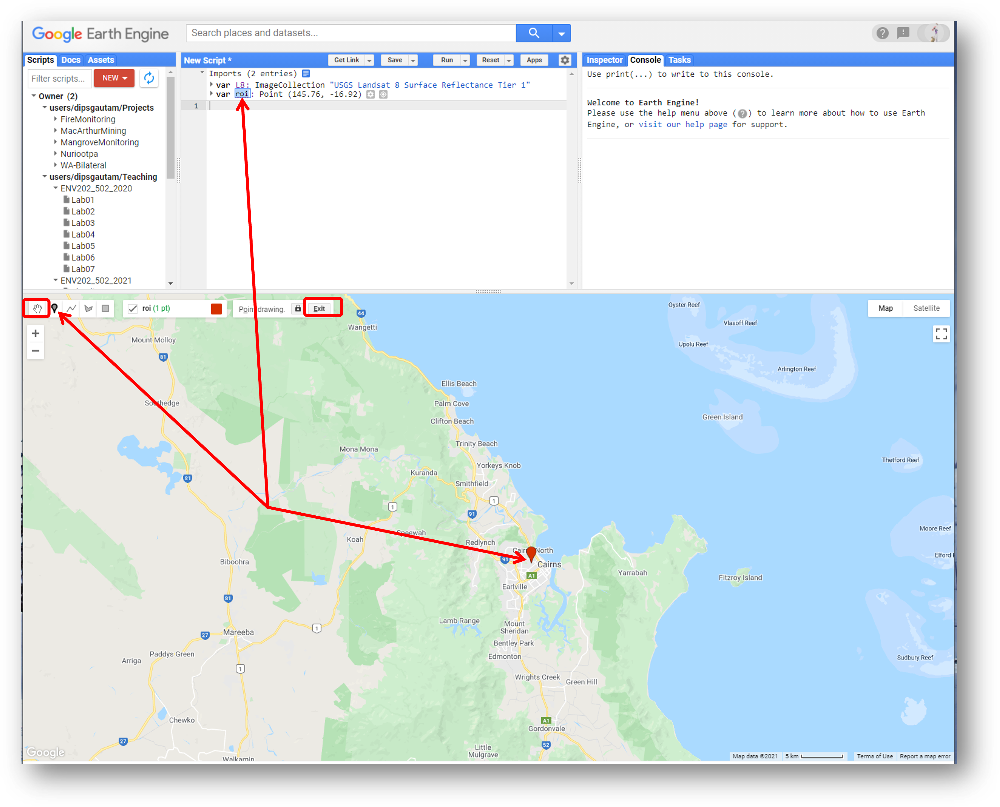

3. Filter the image collection spatially (using the filterBounds command), temporally (using the filterDate command), and lastly sort the images by cloud cover (using the 'CLOUD_COVER' keyword) and extract the least cloudy scene (using the "first" command). Run the script below to extract our desired image from the Landsat 8 collection and add it to the map view as a true-colour composite:

```JavaScript
// Lets filter the image collection to get a single image
var anImage = ee.Image(L8
  // L8 is an image collection so lets  include a geographic filter to narrow the search to images at the location of our point
  .filterBounds(roi)
  // further filter the collection by the the date range we are interested in
  .filterDate('2016-05-01', '2016-06-30')
  // Next we will also sort the collection by a metadata property, in our case cloud cover is a very useful one
  .sort('CLOUD_COVER')
  // Now lets select the first image out of this collection - i.e. the most cloud free image in the date range and over the region of interest
  .first());

//Add true-colour composite to map
Map.addLayer(anImage, {bands: ['B4', 'B3', 'B2'],min:0, max: 0.3, gamma:1.4}, 'True colour image');
```

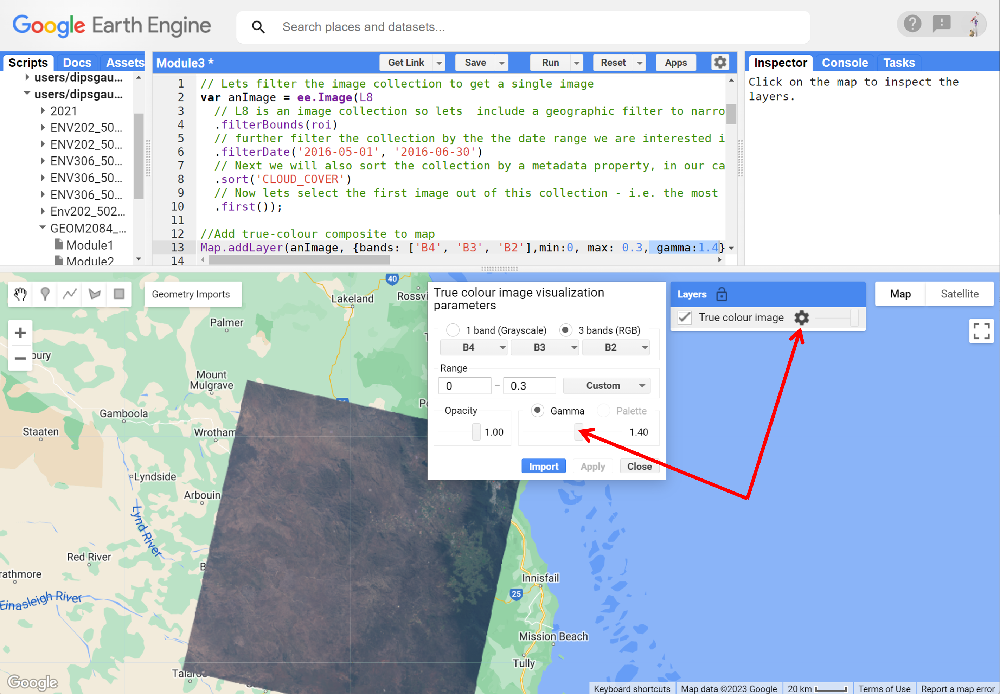

4. Note in the above display we used gamma of 1.4. It's because the original display (with a default gamma of 1.0) was a bit dark. Have a look around the scene and familiarise yourself with the landscape. Can you visually identify urban, water, forest, agriculture, and bareland areas? Before moving forward, think about why would anyone want to classify an image? We can already distinguish different landcover types even before classification. So why bother classifying?  

## 2. Gathering training data for classification

1. In this prac, we will practice supervised classification. Do you remember what a supervised classification is? Well, it involves gathering the training data, training the classifier, performing classification, and analysis of accuracy. If you go into "Docs" of GEE and type classifier, you will see that there are several classifiers available in GEE for us. The principle of classification on any of these classifiers is the same: training data, training, classification, and accuracy analysis. We have learnt most of the classifiers in the lecture. We will use the smileCart classifier in this prac, but feel free to explore others. 

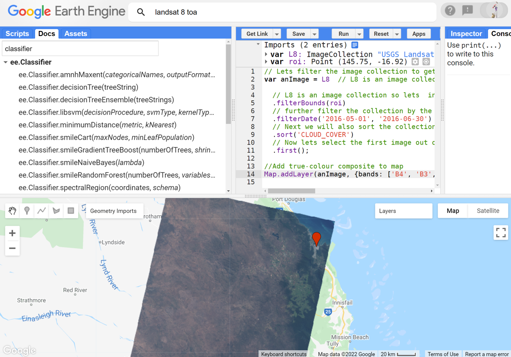

2. Alright, now that you know what classifiers are out there, let's start with the process of gathering the training dataset. So, what is a training dataset? It is like a sample dataset where we tell the classifier how to identify different landcover. When collecting the training dataset, we want to collect representative samples of reflectance spectra for each landcover class of interest. We will first gather a training dataset for one landcover type and then repeat that for other landcover types. Let's do the easy one first - the urban. Hover on the 'Geometry Imports' box next to the geometry drawing tools and click '+ new layer.' The new layer will be imported to the "Geometry Import" box as well as to the import section of your script. Rename the new layer to 'urban'. Notice that the renaming will change the name of the layer in the "Geometry Imports" box.


3. Now, zoom into the "True colour image" layer, pan as needed to select pixels that represent the urban area or built-up areas (buildings, roads, parking lots, etc.). Clicking on the urban area will collect the training data for the urban. Sample minimum of 25 points. For robust classification make sure you are sampling from different types of urban areas (not just one). See the example below.  

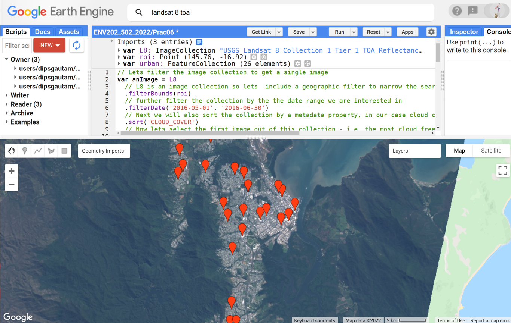

4. Next you need to configure the urban geometry import (cog-wheel, top of the script in imports section) as follows. Click the cog-wheel icon to configure it, change 'Import as'  from 'Geometry' to 'FeatureCollection'. Use 'Add property' landcover and set its value to 0. (Subsequent classes will be 1, 2, 3 etc.). You can also change the colour of the 'teardrops', here if you like. When finished, click 'OK'.


5. Now, repeat steps 2-4 for each land cover class: 'water', 'forest', 'agriculture', and 'bareland'. Collect >25 points for each class. Use the cog-wheel to configure the geometries - change the type to FeatureCollection and set the property name to landcover with values of 1, 2, 3, and 4 for the different classes. Note that in the past students have struggled by not being consistent in their naming, make sure your naming is consistent e.g. "urban" vs "Urban", "landcover" vs "Landcover". By the end, you should have the 5 classes, each with 25+ training data, spread throughout the image - see example below. Here also think about the sampling strategy we learnt in lecture. Are you aiming for some form of sampling strategy? - perhaps stratified random sampling? or simply a random sampling?

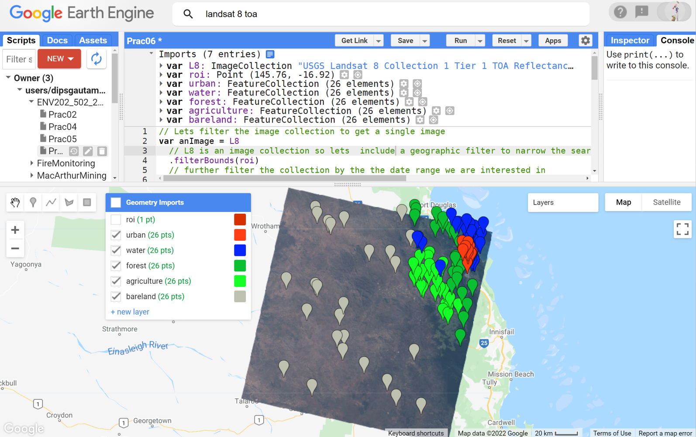

6. Now we have five classes defined (urban, water, forest, agriculture, bareland), but before we can use them to collect training data (i.e. spectral values from each of those points), we need to merge the 5 landcover features into a single collection, called a FeatureCollection. Run the following line to merge the geometries into a single FeatureCollection:

```javascript
// Merge the 5 landcover class features into a single featureCollection
var LandCoverClasses = urban.merge(water).merge(forest).merge(agriculture).merge(bareland);
```

7. You can also print the feature collection and inspect the features using the print command. Each of the features has a different ID and the landcover number you assigned earlier. 

```javascript
// Print the land cover feature collection
print('The land cover feature collection is: ',LandCoverClasses);
```


## 3. Creating the training data

1. So far, we have defined where to gather the training data from. However, we have not yet defined what to gather in the training dataset. Do you know what we want to gather? That's right, it is the spectral reflectance values. So, the classifier will learn about different landcover by looking at their spectral reflectance values in the *feature space*. But first, what bands do we want to let the classifier learn from? Is it a good practice to just dump all the bands for the classifier to learn from? Or, do we want to be strategic and think about which bands might be useful in the context of the landcover we are interested in? - it is the latter. In this exercise we will sample from the visible, near infrared, and SWIR bands. Let's define those bands and sample them at the geometries we have defined and from the Landsat 8 image. 

```javascript
// These will be the bands whose reflectance data will be sampled from the image for training purpose
var bands = ['B2', 'B3', 'B4', 'B5', 'B6', 'B7'];

// add new properties to the "LandCoverClasses" - the new property is the reflectance data from the above bands
var TrainingDataset = anImage.select(bands).sampleRegions({ // sample the reflectance from selected bands
  collection: LandCoverClasses, // save the reflectance to the LandCoverClasses
  properties: ['landcover'],
  scale: 30
});

// print our training dataset
print('The training dataset is: ', TrainingDataset);
```

2. That's it- that's all you need to do when you sample the training dataset. After running the script the training data will be printed to the console. To see what new has happened, you can expand the printed information. You will notice that new 'properties' information has been added to the feature collection. The properties contain exactly the band numbers we defined above.


## 4. Train the classifier and run the classification

1. So far, we have sampled the training dataset. Now we can train the classifier using the training dataset - above information. Here, we will train the smileCart classifier. I encourage you to try other classifiers too.

```javascript
// train our classifier. Here we used cart classifier.
var classifier = ee.Classifier.smileCart().train({
  features: TrainingDataset, // Training dataset to use
  classProperty: 'landcover', // Landcover types to train
  inputProperties: bands // the bands to use to train.
});

```

2. The next step is applying the trained classifier to classify the rest of the image (i.e., the pixels we did not use for training). The classifier learns from the training dataset to decide which class all the remaining pixels should belong to.  

```javascript
//Run the classification for the entire scene
var classifiedImage = anImage.select(bands).classify(classifier);
```

3. At this point, classification has happened in the GEE - it is quite fast. However, we haven't asked to display the classified map to our mapping layer. Use the Map.addLayer function to display the results as below. You may need to adjust the colours, but if the training data have been created with urban=0, water=1, forest=2, agriculture=3, and bareland =4  - then the result will be rendered with those classes as red, blue and darkgreen, lightgreen, and grey respectively.


```javascript
//display classified map. The colour scheme defined below is set according to the numbering of the class. e.g. class0 was urban which is set to red. Also, note that the max value is set to 4 as we have 5 classes.
Map.centerObject(roi, 8); // to centre the map display with roi in the middle. 8 is the zoom level
Map.addLayer(classifiedImage, {min: 0, max: 4, palette: ['red', 'blue', 'darkgreen','lightgreen', 'gray']}, 'Classified map');
```
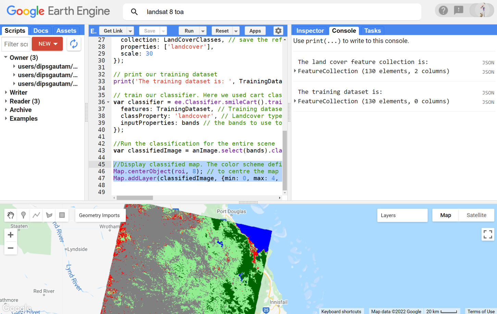

4. Visually inspect if the classification has performed as expected. You can untick the landcover geometries within "Geometry Imports" to hide them. From the 'Geometry Import' box, untick all the geometries for better visualisation. Looks like there are several misclassifications in my map. I can see that agriculture has been over-represented in the map, the urban also seems to be overly present towards the western end of the image. Your classification result will not be the same as mine. Can you guess why? That's right because the location of the training dataset for you and me is not the same. Explore your map and think about where misclassification occurred and why would that be. 


5. To analyse individual classes, you can always apply a mask so, only one class is visible to your map. Below I have mapped the forest class in green. 
```JavaScript
// you can choose any of the individual classes to display. Here I am displaying class 2 which is forest.
Map.addLayer(classifiedImage.updateMask(classifiedImage.select('classification').eq(2)), {palette: ['green'], min: 0, max: 1},'Forest only');
```

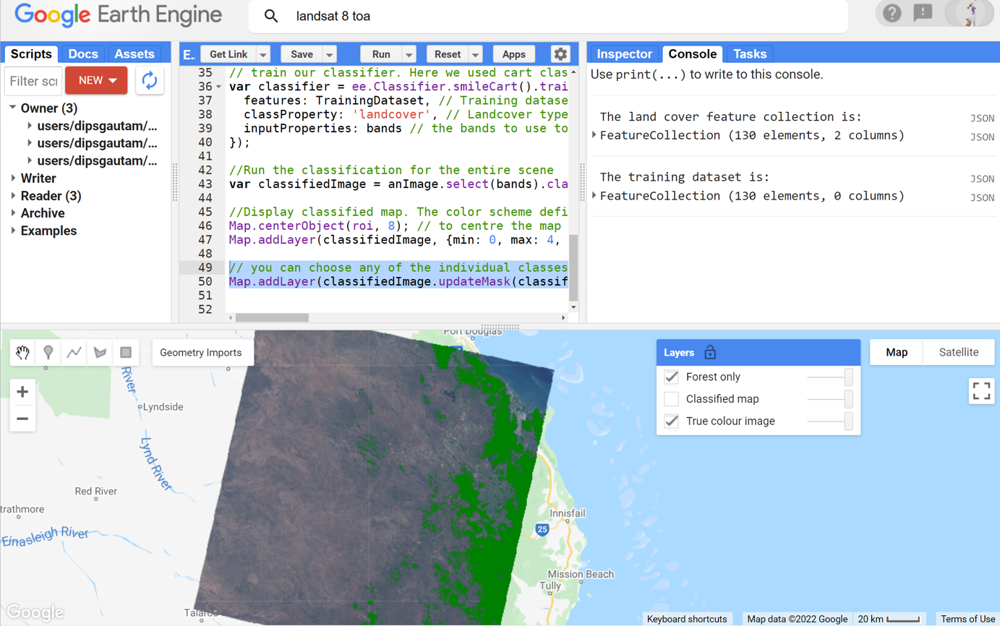

6. Not too bad hey. Looks like the forest classification was reasonably okay. Now you can modify the script to check for other individual classes. 

7. Now that you have 5 different classes, you can also calculate the area of each class. For example, you are into forest management and want to know the forest area at a particular point in time, you could use the classified map to calculate the area as below.

```JavaScript
// Calculate the forest area in the landsat scene
var forestArea = classifiedImage.eq([2]).multiply(ee.Image.pixelArea()).reduceRegion({
 reducer:ee.Reducer.sum(),
  scale:30,
 bestEffort:true
});

// print the forest area after converting to Km2
print ('Forest area in (km²):', ee.Number(forestArea.get('classification')).divide(1e6));
```

8. I got a forest area of 5534 square Km. What did you get? With this skill, you can check the forest area or, agricultural area or any other landcover area in any region at any given time. 
 
9. Congratulations on your first landcover classification! Zoom in explore and have fun. 
- Are you happy with the classification?
- How could the classification be improved?
- Would adding in extra landcover classes be helpful. 
- Is using point geometry the ideal way to go about sampling training dataset?
- How accurate is your map?


## 5. Use polygons instead of points to sample the training data.

1. Our existing training dataset is point-based. Let's delete all of them so we can sample from polygon. Before deleting take a snapshot of the classified image for comparison. 

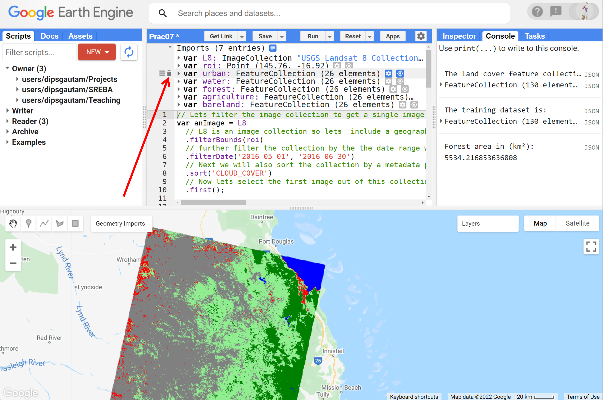

2. Now, follow the steps we learnt in above section to re-sample the training data for classification - use polygon this time not point. Note you can sample more than one polygon for a landcover class. Start with urban landcover - do not exceed 5000 pixels. 


3. Follow the steps we learned in above section to configure the urban polygon data. The configuration is exactly the same.

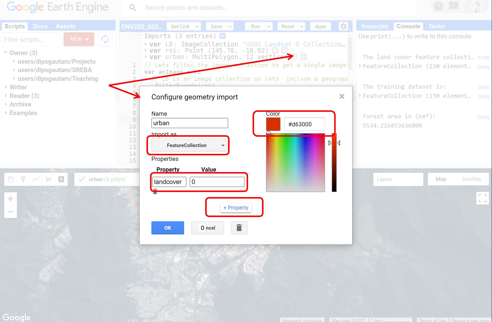

4. Repeat the above steps [step 2 and step 3] to define all the landcover types: let's add water, forest, agriculture, bareland – same order as previous section


5. The polygons look very small at this zoom level, but they are there. Notice how I have sampled multiple but smaller polygons, which, potentially captures the variability within each class. 

6. Run the script to get a classified map. The script should just work without any modification as long as you have named the classes and properties exactly as the previous section. Here, the classifier used polygons instead of points for training. If the 5000 pixels has been exceeded in your training dataset, GEE will complain and you will need to make your training polygons smaller.
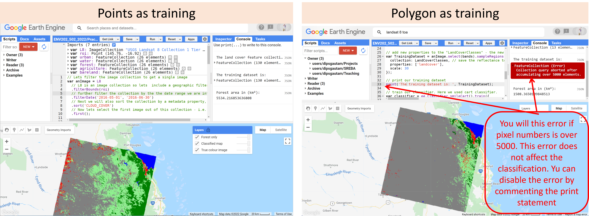

7. Compare the two classified maps where the training data was obtained from points vs the polygons. Do you notice any improvement? I can see that the agricultural area is drastically reduced while the bareland area has increased substantially. The forest and the urban area has shrunken as well. The dried streams in the outback have been classified as urban. Overall, this looks better. However, how do I know that this is better or worse than the previous classified map? This is where the accuracy assessment comes in. With accuracy assessment, we can quantify the errors in the classification which then can be used to justify the improvement if any.   

## 6. Accuracy assessment

1. Do you remember what do we need for the validation? - we need to sample the validation dataset. Normally this validation dataset would be something that is collected by going out in the field using GPS and recording different landcover types by actual observation. However, that's not possible to do here. So, we will sample the validation dataset in the same way we sampled the training dataset - by looking into the map. 
  - Sample the validation dataset in the same way you collected training data
  - collect validation data for the same classes but name them differently (vUrban, vWater, vForest, vAgriculture, vBareland)
  - do not overlap the validation data with training data
  - do not exceed 5000 pixels. 
  - use the same property names and labels number as in training dataset

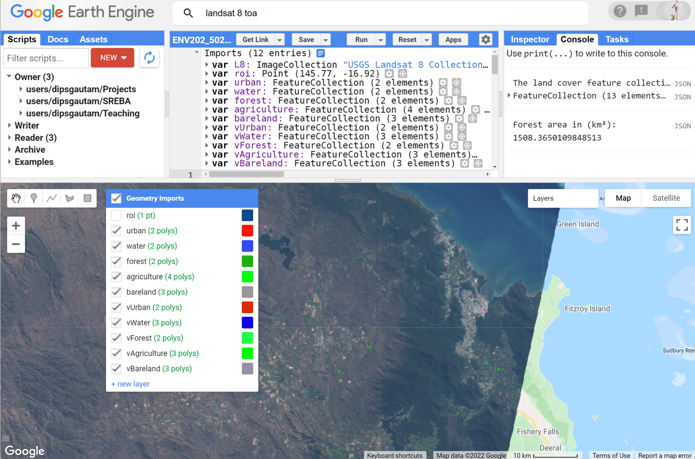

2. To run the validation, we need to repeat some of the scripting steps. First, merge your validation polygons into one Feature Collection. Remember we did the same for the training dataset as well. You can add the following script below your existing script in Google Earth Engine. 

```JavaScript
//Merge validation polygons into one FeatureCollection
var valLandCoverClasses = vWater.merge(vUrban).merge(vForest).merge(vAgriculture).merge(vBareland);
```  
  
3. Again similar to the training dataset, sample your validation dataset. Note that this validation dataset is sampled from the classified image while the training dataset was sampled from the original image.  

```JavaScript
var validationDataset = classifiedImage.sampleRegions({
  collection: valLandCoverClasses,
  properties: ['landcover'],
  scale: 30,
});
// print(validation); // This print will not work if you have sampled over 5000 pixels.
```

4. Now run the accuracy assessment and obtain the error matrix. This will print the error matrix for you. Refer to the lecture and the reading materials to understand the error matrix also known as the confusion matrix.  

```JavaScript
//Compare the landcover of your validation data against the classification result
var errorMatrix = validationDataset.errorMatrix('landcover', 'classification');
//Print the error matrix to the console
print('Validation error matrix: ', errorMatrix);
```

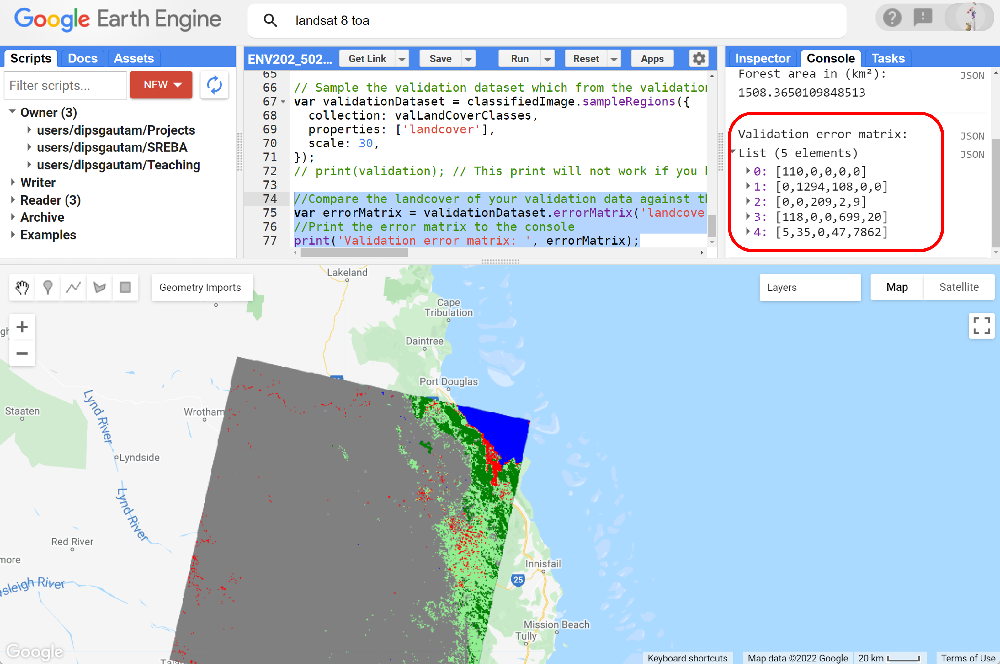

5. Earth Engine also has built-in functions to compute accuracies such as User's and Producer's accuracy, kappa coefficient. Run the script below to compute the accuracies.

```JavaScript
//Print the overall accuracy to the console
print('Overall accuracy: ', errorMatrix.accuracy());

//Print the user's accuracy to the console
print('Consumer accuracy: ', errorMatrix.consumersAccuracy());

//Print the producers accuracy to the console
print('Producer accuracy: ', errorMatrix.producersAccuracy());

//Print the kappa coefficient accuracy to the console
print('Kappa coefficient: ', errorMatrix.kappa());
```
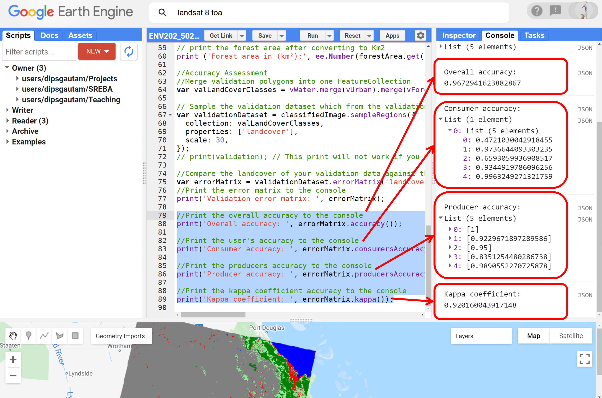

6. Think about how the classification went and what all these accuracies numbers mean.

7. Above we calculated the area of forest cover. Repeat that and calculate the area of all the landcover using latest classification results.  

## 7. Further refining and improvement ideas

Now you have the base accuracy assessment numbers. Are you happy with the classification result? How can we improve it and what are our options? Below are a few options for you to explore. Try them and if you are stuck, discuss them on the discussion board and get back to me in the next class.

1. Changing the training sample size: - We have already tried this. By incorporating polygons we are sampling from more than 25 pixels.

2. Changing the sampling strategy: - This is where you can try different sampling strategies we learned in the lecture. Try experimenting with a stratified sampling approach.

3. Changing the classifier: - We used a CART classifier, we could try a different approach such as a support vector machine (SVM) or randomForest (randomForest) approach (search for these commands in the docs section).

4. Changing the input bands: - We classified the landscape using 6 bands [B2--B7]. You could always add additional bands which may improve the classification. 

5. Adding derived indices as input: - In addition to the bands, you could try to add ancillary information, such as elevation data, or a derived index such as NDVI, NDWI which may help better discrimination between the classes. 


## 8. Complete script 
```JavaScript
// this script is missing a) definition of ROI, b) import of Landsat-8 image collection, c) definition of all the training dataset, d) definition of all the validation datasets.  

// Lets filter the image collection to get a single image
var anImage = ee.Image(L8 
  // L8 is an image collection so lets  include a geographic filter to narrow the search to images at the location of our point
  .filterBounds(roi)
  // further filter the collection by the the date range we are interested in
  .filterDate('2016-05-01', '2016-06-30')
  // Next we will also sort the collection by a metadata property, in our case cloud cover is a very useful one
  .sort('CLOUD_COVER')
  // Now lets select the first image out of this collection - i.e. the most cloud free image in the date range and over the region of interest
  .first());

//Add true-colour composite to map
Map.addLayer(anImage, {bands: ['B4', 'B3', 'B2'],min:0, max: 0.3, gamma:1.4}, 'True colour image');


// Merge the 5 landcover class features into a single featureCollection
var LandCoverClasses = urban.merge(water).merge(forest).merge(agriculture).merge(bareland);

// Print the land cover feature collection
print('The land cover feature collection is: ',LandCoverClasses);

// These will be the bands whose reflectance data will be sampled from the image for training purpose
var bands = ['B2', 'B3', 'B4', 'B5', 'B6', 'B7'];

// add new properties to the "LandCoverClasses" - the new property is the reflectance data from the above bands
var TrainingDataset = anImage.select(bands).sampleRegions({ // sample the reflectance from selected bands
  collection: LandCoverClasses, // save the reflectance to the LandCoverClasses
  properties: ['landcover'],
  scale: 30
});

// print our training dataset
//print('The training dataset is: ', TrainingDataset);

// train our classifier. Here we used cart classifier.
var classifier = ee.Classifier.smileCart().train({
  features: TrainingDataset, // Training dataset to use
  classProperty: 'landcover', // Landcover types to train
  inputProperties: bands // the bands to use to train.
});

//Run the classification for the entire scene
var classifiedImage = anImage.select(bands).classify(classifier);

//display classified map. The colour scheme defined below is set according to the numbering of the class. e.g. class0 was urban which is set to red. Also, note that the max value is set to 4 as we have 5 classes.
Map.centerObject(roi, 8); // to centre the map display with roi in the middle. 10 is the zoom level
Map.addLayer(classifiedImage, {min: 0, max: 4, palette: ['red', 'blue', 'darkgreen','lightgreen', 'gray']}, 'Classified map');

// you can choose any of the individual classes to display. Here I am displaying class 2 which is forest.
Map.addLayer(classifiedImage.updateMask(classifiedImage.select('classification').eq(2)), {palette: ['green'], min: 0, max: 1},'Forest only');

// Calculate the forest area in the landsat scene
var forestArea = classifiedImage.eq([2]).multiply(ee.Image.pixelArea()).reduceRegion({
 reducer:ee.Reducer.sum(),
  scale:30,
 bestEffort:true
});

// print the forest area after converting to Km2
print ('Forest area in (km²):', ee.Number(forestArea.get('classification')).divide(1e6));

//Accuracy Assessment
//Merge validation polygons into one FeatureCollection
var valLandCoverClasses = vWater.merge(vUrban).merge(vForest).merge(vAgriculture).merge(vBareland);

// Sample the validation dataset which from the validation landcover polygons
var validationDataset = classifiedImage.sampleRegions({
  collection: valLandCoverClasses,
  properties: ['landcover'],
  scale: 30,
});
// print(validation); // This print will not work if you have sampled over 5000 pixels.

//Compare the landcover of your validation data against the classification result
var errorMatrix = validationDataset.errorMatrix('landcover', 'classification');
//Print the error matrix to the console
print('Validation error matrix: ', errorMatrix);

//Print the overall accuracy to the console
print('Overall accuracy: ', errorMatrix.accuracy());

//Print the user's accuracy to the console
print('Consumer accuracy: ', errorMatrix.consumersAccuracy());

//Print the producers accuracy to the console
print('Producer accuracy: ', errorMatrix.producersAccuracy());

//Print the kappa coefficient accuracy to the console
print('Kappa coefficient: ', errorMatrix.kappa());


```
-------
## 9. Summary
Today is the third Module of your journey in using Earth Engine for Earth Observation. Today we covered image classification and accuracy assessment. In the Next Module, we will look into working with drone-based images for agricultural applications.

I hope you found this prac useful. I encourage you to play with the script, make changes, and make mistakes. A recorded video of this prac can be found on your Canvas shell.

Thank you
Kind regards, 
Deepak Gautam
------

