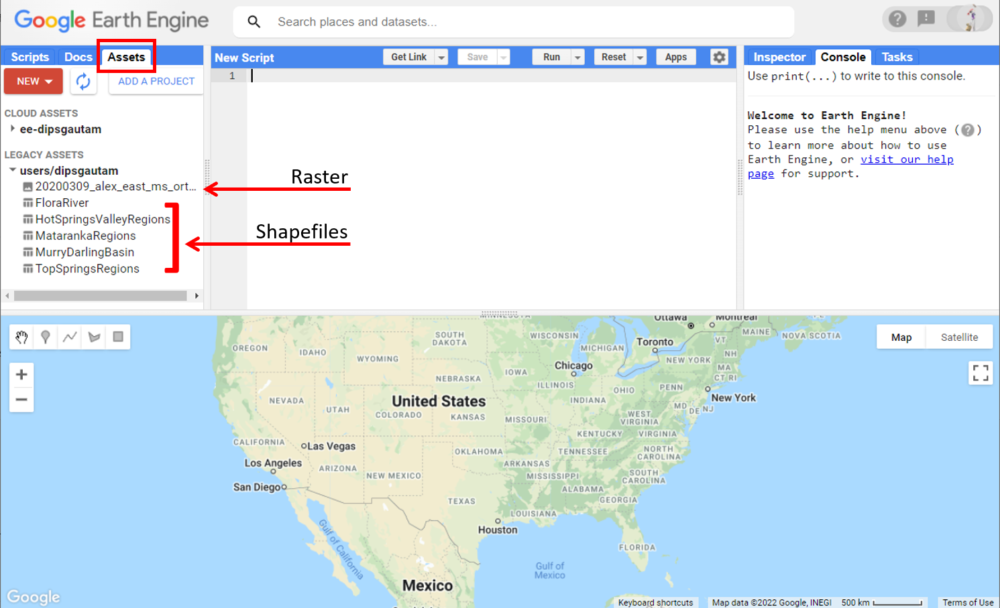
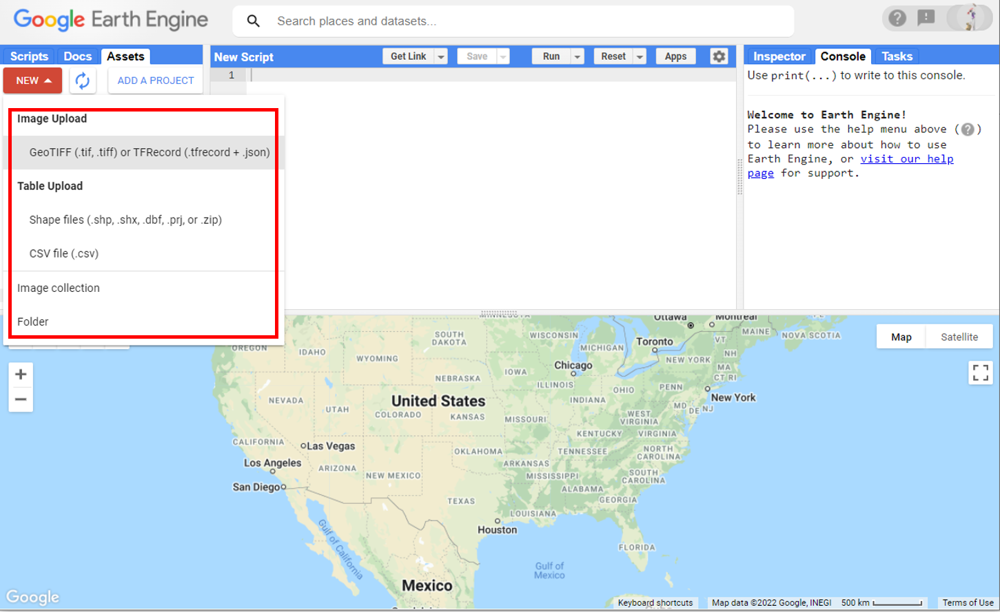
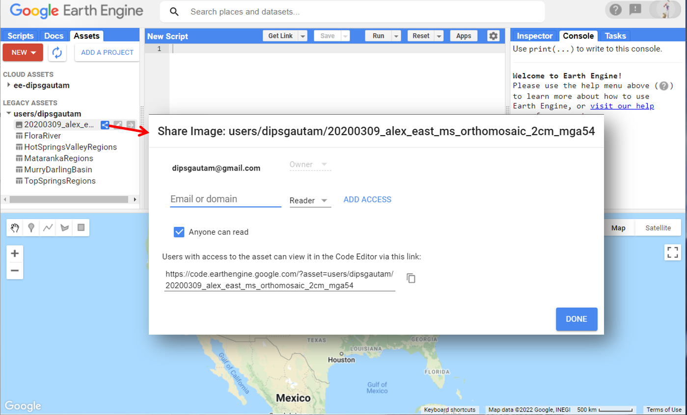
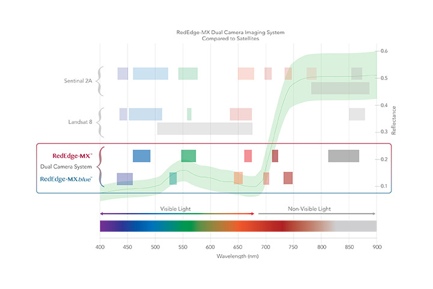
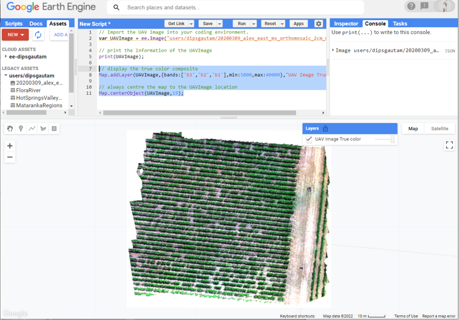
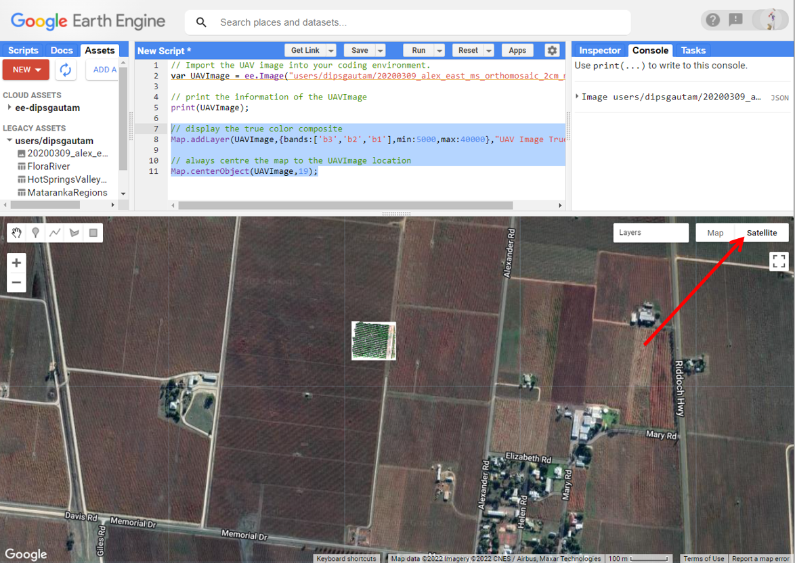
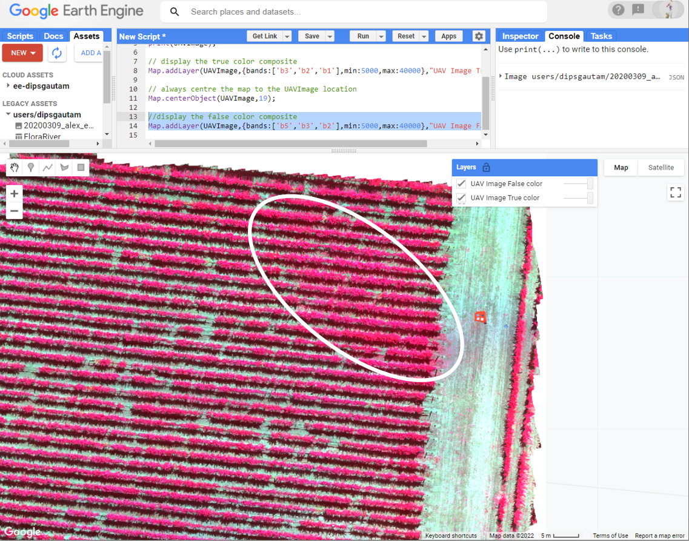
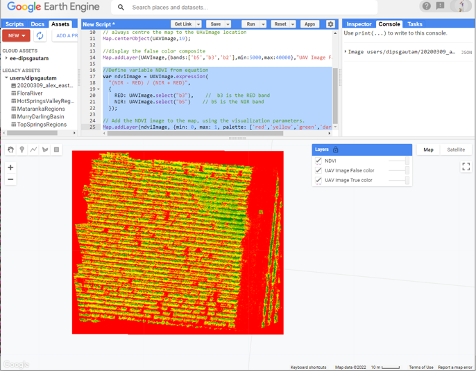
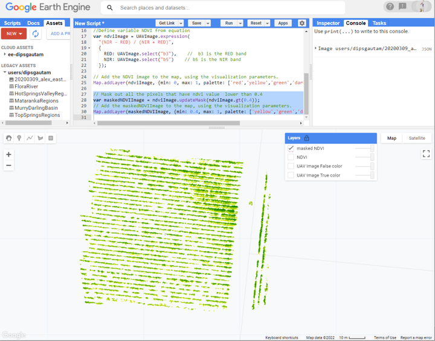
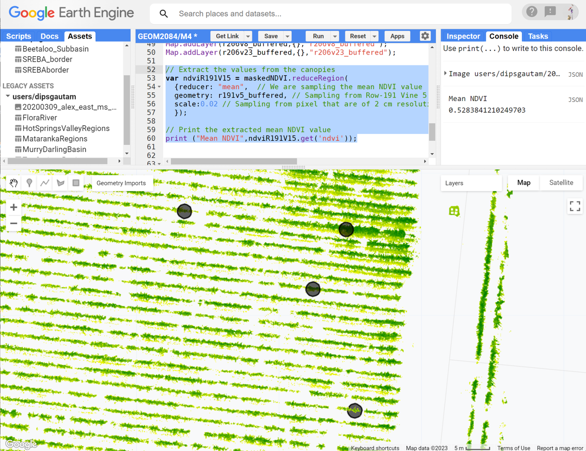

# Earth Observation Science (GEOM2084)
Module 4 Prac - Drone-based multispectral images for agricultural application


### Acknowledgments 
- [Wine Australia](https://www.wineaustralia.com/) and [University of Adelaide](https://sciences.adelaide.edu.au/agriculture-food-wine/).
- Data from [this publication](https://www.mdpi.com/2072-4292/13/13/2639/htm) and [this publication](https://link.springer.com/article/10.1007/s00271-023-00866-7)

### Learning objectives
The learning objectives of this Module are:
- to gain experience working with drone-based images. 
- to understand the similarities and differences between satellite and drone remote sensing.
- to use drone and ground data to model agricultural crops traits. 
- to transfer the modelling to satellite observation

---------------------------------------------------
## 1. How did the drone data get into the Google Earth Engine?
1. Well Google Earth Engine dont normally subscribe to drone imagery. However, as a user, you can always upload your data to GEE. Click on the Assets tab to see if you have some Google Earth Engine assets. Your assets could be raster/vector images or shapefiles. You can see that I have 1 raster and several shapefile living in my Assets. 


2. To add your own data, you can always click on New button and then select the relevant option and follow through. The google earth engine will then ingest the data. 


3. Once the data is ingested, you can share the data with anyone you like by adding their email or domain or make the data publicly available by clicking on the "anyone can read" button. 



4. You dont need to repeat the above steps or follow them. You just need to know how to put your own data in GEE which may be handy for your future projects, work, collaborations, or studies. 

## 2. Importing and visualisation of the image
1. Use the below script to import the drone data into your coding environment.
```JavaScript
// Import the UAV image into your coding environment.
var UAVImage = ee.Image("users/dipsgautam/20200309_alex_east_ms_orthomosaic_2cm_mga54");
```

2. First lets learn abou the dataset. This dataset is over a Cabernet Sauvignon vineyard in Coonawarra region of South Australia. The name of the file "20200309_alex_east_ms_orthomosaic_2cm_mga54" has a lot of information. This data was acquired at 9th of March 2020 over a vineyard called Alex at the eastern end. It is a multispectral image at 2 cm spatial resolution in MGA 54 coordinate system. Early march for the Cabernet Sauvignon in Coonawarra corresponds to the the post-veraison phenology stage of the grapevine. This is when the berris have completly turned purple and are now ripening and accumulating sugars. The accumulation of sugars is depends on the level of leaf photosynthesis which could be restricted by abiotic stress in the plant. So, for higher quality of wine, it is necessary that plants photosynthetic activities are at optimal level and plants are healthy. Its a very complex topic but thats the summary you might find useful. 

3. To access the photosynthetic activities and abiotic stress of the grapevine, I have acquired multispectral and thermal imagery of the grapevine (thermal is not included here). In this exercise, we will perform simple analysis using NDVI to access the canopy-specific assessment of photosynthesis and abiotic stress. 

4. The multispectral data was collected using one of the multispectral camera called [MicaSense RedEdge-MX](https://micasense.com/rededge-mx/). You can have a read about the sensor specification and think about the bands that this sensor can collect and its significance. Below is the image showing the bands that this sensor collects. 

 

5. Now, try printing the information of the "UAVImage" to see the band information.
```JavaScript
// print the information of the UAVImage
print(UAVImage);
```

6. The image has 6 bands named "b1" (blue), "b2" (green), "b3" (red), "b4"(red-edge), "b5"(near infrared), "b6" (alpha band - ignore). Now, display the true color composite of the image. You know how to do it. 

```JavaScript
// display the true color composite
Map.addLayer(UAVimage,{bands:['b3','b2','b1'],min:5000,max:40000},"UAV Image True color");
```

7. The image has been displayed but we dont kow where in the world the image is. Add following lines below so when the image is displayed, your map automatically pans over to the image. 
```JavaScript
// always centre the map to the UAVImage location
Map.centerObject(UAVImage);
```
 

8. The amount of detail you can see in this image is quite amazing. You can see individual shoots of the vine, the shadows of the canopy, the stem, several GCPs (whats GCPs - recall from lecture?), and four calibration panels. Zoom in pan over, enable the satellite view and explore the Coonawarra region. 



9. While there are four calibration panels placed in the scene for radiometric calibration - the image I uploaded is not a radiometrically calibrated image. The data stored in each pixels are not reflectance but DN values. The DN values range from 0 to 65535. *Can you guess the radiometric resolution of theis image?* In this prac, we are not focusing of radiometric calibration and we will simply ignore it. Lets also display the false-color composite which highlights the photosynthetically active vegetation. 

```JavaScript
//display the false color composite
Map.addLayer(UAVImage,{bands:['b5','b3','b2'],min:5000,max:40000},"UAV Image False color");
```



10. The false color highlights the photosynthetically active vegetation in bright pink color. You can see that the entire vineyard is bright pink. The north-eastern end has more pink pixels indicating the dense canopies. Also notice the heavy under-canopy vegetation at that location. This was the area where there was leakage in irrigation water. Due to this the vines at this location were highly vigorous as well as inter-row vegetation was present. 

## 3. Computation of indices
1. Can you recall the script we used to compute the NDVI for Landsat-8 and Sentinel-2 images and modify that to calculate NDVI for this image? This should be not too difficult for you at this point. Use below script to compute and add the NDVI map to the GEE. 

```JavaScript
//Define variable NDVI from equation
var ndviImage = UAVImage.expression(
  "(NIR - RED) / (NIR + RED)",
  {
    RED: UAVImage.select("b3"),    //  b3 is the RED band
    NIR: UAVImage.select("b5")    // b5 is the NIR band
  }).rename('ndvi');

// Add the NDVI image to the map, using the visualization parameters.
Map.addLayer(ndviImage, {min: 0, max: 1, palette: ['red','yellow','green','darkgreen']}, "NDVI");
```



2. The image looks overwhelmingly red in color. Do you know why that is? The low NDVI value within the grapevine rows represent the inter-row baresoil. The big red patch to the left represent the dirtroad and the reds on the edges are the no-data pixels. The Yellow color represents the shadow of the canopies, and some sparse vegetation. The green color represent some canopies and some inter-row grass. The dark green color is mostly the grapevine and also some lush green grass. This is not the best looking NDVI image - we can do better. What we are really interested here is the canopy pixels and dont care much about the non-canopy pixels. So, we can mask the image using NDVI threshold and display the masked NDVI image. Trial with different thresholding NDVI value that may result in better approcimation of pure canopy pixel. 

```JavaScript
// Mask out all the pixels that have ndvi value  lower than 0.4
var maskedNDVI = ndviImage.updateMask(ndviImage.gt(0.4));

// Add the maskedNDVI to the map, using the visualization parameters.
Map.addLayer(maskedNDVI, {min: 0.4, max: 1, palette: ['yellow','green','darkgreen']}, "masked NDVI");
```


4. In the above display, I have masked all the pixels that had NDVI value lower thatn or equal to 0.4. This is a very restrictive mask however, perhaps does good job of limiting the interrow grass. The yellow color now represents some canopies and some interrow vegetation, the green color is mostly grapevine, the darkgreen color is very lush green grapevine.

5. The masking is not perfect but much better than initial reddy image. Can you think of any further technique you may use to mask the non-canopy pixels out? If you were to collect additional data for masking purpose, what would that be?

## 4. Extract canopy-specific NDVI value
1. A bit of context - this is one of the vineyard where we had intensive data collection in from 2018 to 2021. Our data included several ground-based data acquiring plant specific biophysical and physiological data as well as drone-based imaging. We had fixed vines spatially spread that we would go to every month and acquire data temporally. Below are four coordinates of 4 out of 32 vines that we measured. We will use the coordinates to define our vine position and sample the NDVI values form the masked NDVI image that we have displayed. 

```JavaScript
// Define the coordinate sof the four vines
r191v5 = ee.Geometry.Point([140.82946004591133, -37.286255642184436]);
r201v11 = ee.Geometry.Point([140.82935912779715, -37.28602196707126]);
r206v8 = ee.Geometry.Point([140.82943927982373, -37.28590726084841]);
r206v23 = ee.Geometry.Point([140.82904924791364, -37.28587241960449]);
```

2. In the above definition, r191v5 means the vine is in row number 191 (every row has its own numbering) and vine number 5 within that row. You can hover your curser over the geometry definition on your script and click on "convert" to move the geometries to the import section.


2. We can now go ahead and buffer our vine coordinate. Why we want to buffer is such that when we sample the NDVI values, we are not sampling from 1 pixel but from all the representative pixels of the grapevine. From the field visit, I can tell you that each vine was about 1.5 m in length and the vine row spacing was about 1.5 m. This means having a 1.5 buffer around the vine coordinate will approximately result in sampling from a single vine. 

```JavaScript
// Buffer the point geometry
var r191v5_buffered = r191v5.buffer(1.5);
var r201v11_buffered = r201v11.buffer(1.5);
var r206v8_buffered = r206v8.buffer(1.5);
var r206v23_buffered = r206v23.buffer(1.5);

// display the buffered geometry
Map.addLayer(r191v5_buffered,{},"r191v5_buffered");
Map.addLayer(r201v11_buffered,{},"r201v11_buffered");
Map.addLayer(r206v8_buffered,{},"r206v8_buffered");
Map.addLayer(r206v23_buffered,{},"r206v23_buffered");
```


3. Now we have the buffered polygon and masked NDVI image, we will sample the canopy NDVI value using below script. 

```JavaScript
// Extract the values from the canopies
var ndviR191V5 = maskedNDVI.reduceRegion(
  {reducer: "mean",  // We are sampling the mean NDVI value
  geometry: r191v5_buffered, // Sampling from Row-191 Vine 5
  scale:0.02 // Sampling from pixel that are of 2 cm resolution
  });

// Print the extracted mean NDVI value
print ("Mean NDVI",ndviR191V5.get('ndvi'));
```



4. For the grapevine sitting at Row 191 and and plant number 5, I got the mean NDVI value to be 0.53. What did you get in your case? pretty similar I suppose. Do you know that instead of using 'meam' in the avove script, you can also use 'max', 'median', 'sum', 'count' to extract different aspect of canopy NDVI values. 

5. Now modify on the step 3 script to extract the mean NDVI value for remaining 3 vines and keep a record. In my case I got the following: R191V5 - 0.53, R201V11 - 0.55, R206V8 - 0.59, R206V23 - 0.53 

## 5. Linear modelling of ground observation using aerial observation
1. Okay, now we have the NDVI values from the canopy pixels for the four observation vines. We also have corresponding net photosynthesis value for the corresponding vines measured on the ground using a specialist instrument. Here we will perform a simple linear regression using the four datapoints that we have. Four datapoints is in no way sufficient for a robust modelling, but for this exercise this is enough. Below I have put together the NDVI values I got and corresponding net photosynthesis we measured. 

| VineID | net Photosynthesis | NDVI |
|--------|--------------------|------|
| R191V5 | test| test|
| R191V5 | test| test|
| R191V5 | test| test|
| R191V5 | test| test|


## 6. Applying the regression model to satellite image

-------
## 9. Summary
Today is the final Module of your journey in using Earth Engine for Earth Observation. Today we covered image classification and accuracy assessment. In the Next Module, we will look into working with drone-based images for agricultural applications.

I hope you found this prac useful. I encourage you to play with the script, make changes, and make mistakes. A recorded video of this prac can be found on your Canvas shell.

Thank you
Kind regards, 
Deepak Gautam
------